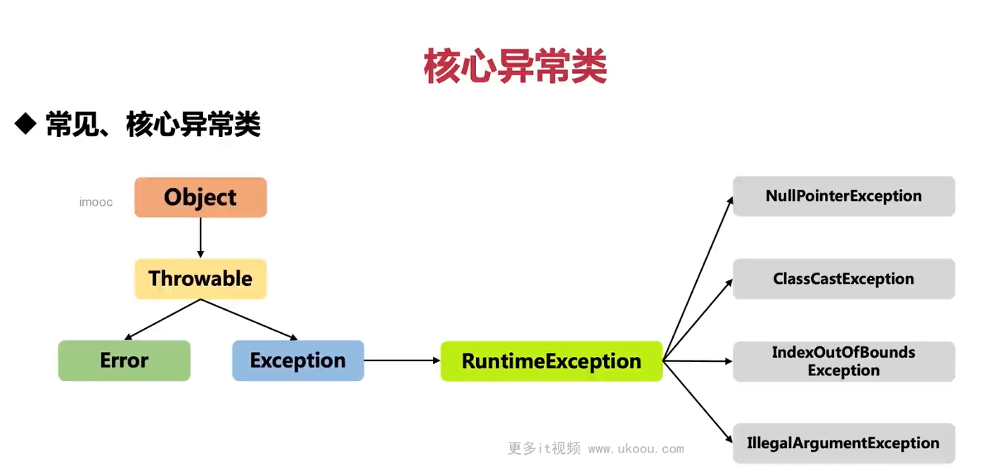

### 1. NullPointerException (NPE)

**定义**:
`NullPointerException` 是当尝试访问一个 `null` 对象的方法或字段时抛出的异常。这是最常见的一种运行时异常，通常发生在程序员尝试使用尚未被初始化的对象引用时。

**示例**:

```java
String str = null;
int length = str.length(); // 抛出 NullPointerException
```

**解决方法**:

- 在访问对象之前检查是否为 `null`。
- 使用 Java 8 引入的 `Optional` 类来避免 `null` 的使用。
- 如果是来自外部系统或库的返回值，请确保了解其行为，并做好相应的检查。

### 2. ClassCastException

**定义**:
`ClassCastException` 发生在尝试将对象强制转换为不是该对象实际类型的类时。这是类型不匹配的错误。

**示例**:

```java
Object obj = new Integer(1);
String str = (String) obj; // 抛出 ClassCastException
```

**解决方法**:

- 在执行强制类型转换之前使用 `instanceof` 关键字检查对象的实际类型。
- 使用泛型来减少强制类型转换的需求。

### 3. IndexOutOfBoundsException

**定义**:
`IndexOutOfBoundsException` 是一组异常的超类，包括 `ArrayIndexOutOfBoundsException` 和 `StringIndexOutOfBoundsException`。这些异常通常发生在数组或字符串的索引超出范围时。

**示例**:

```java
int[] array = new int[3];
int value = array[3]; // 抛出 ArrayIndexOutOfBoundsException
```

**解决方法**:

- 检查数组或字符串的长度。
- 使用循环时确保索引不会越界。
- 验证索引值的有效性。

### 4. IllegalArgumentException

**定义**:
`IllegalArgumentException` 表示传递给方法的参数不合法或不合适。这通常是因为参数违反了方法的约束条件。

**示例**:

```java
public void divide(int numerator, int denominator) {
    if (denominator == 0) {
        throw new IllegalArgumentException("Denominator cannot be zero.");
    }
    System.out.println(numerator / denominator);
}

divide(10, 0); // 抛出 IllegalArgumentException
```

**解决方法**:

- 在方法内部验证传入参数的有效性。
- 使用注释或文档明确指出参数的约束条件。
- 在适当的情况下使用 `assert` 关键字来检查参数。

这些异常都是运行时异常，意味着它们不需要被捕获或声明，但如果程序中不妥善处理这些异常，程序就会终止。为了提高代码的质量和健壮性，建议对可能出现这类异常的情况进行适当的检查和处理。
