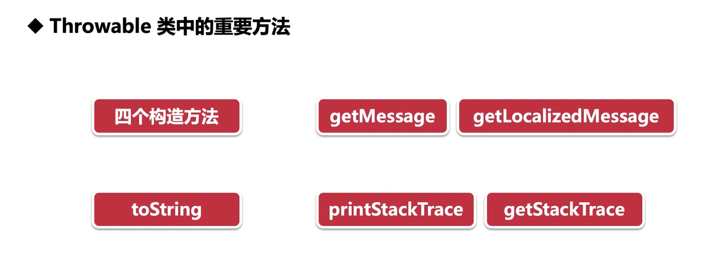

在 Java 中，`Throwable` 类是所有错误或异常的基类，它提供了许多有用的方法来帮助开发者诊断和处理程序中的问题。下面是您提到的一些重要方法及其描述：

### Throwable 类的重要方法

#### 1. 构造方法

`Throwable` 类提供了多个构造方法，用于创建 `Throwable` 对象的不同实例。

- **无参构造方法**:

  ```java
  public Throwable() {}
  ```

  创建一个新的 `Throwable` 实例，没有指定消息或原因。

- **带有详细消息的构造方法**:

  ```java
  public Throwable(String message) {}
  ```

  创建一个新的 `Throwable` 实例，并指定一个描述此异常的详细消息。

- **带有原因的构造方法**:

  ```java
  public Throwable(Throwable cause) {}
  ```

  创建一个新的 `Throwable` 实例，并指定导致此异常的原因。

- **带有详细消息和原因的构造方法**:
  ```java
  public Throwable(String message, Throwable cause) {}
  ```
  创建一个新的 `Throwable` 实例，并指定描述此异常的详细消息以及导致此异常的原因。

#### 2. `toString()` 方法

```java
public String toString()
```

返回表示此 `Throwable` 的字符串。这个方法通常返回类名和详细消息，如果有的话。

#### 3. `getMessage()` 方法

```java
public String getMessage()
```

返回此 `Throwable` 的详细消息字符串。如果详细消息未设置，则返回 `null`。

#### 4. `printStackTrace()` 方法

```java
public void printStackTrace()
```

将此 `Throwable` 及其追踪输出到标准错误流（`System.err`）。这是一个非常有用的调试工具，可以显示异常发生的位置。

#### 5. `getLocalizedMessage()` 方法

```java
public String getLocalizedMessage()
```

返回此 `Throwable` 的本地化消息字符串。这个方法通常用于返回特定于语言环境的消息，但在很多情况下，它的实现与 `getMessage()` 相同。

#### 6. `getStackTrace()` 方法

```java
public StackTraceElement[] getStackTrace()
```

返回一个表示此 `Throwable` 调用堆栈的数组。这个方法返回的数组包含了异常发生时的调用堆栈信息，每个元素代表调用堆栈中的一个帧。

### 示例代码

下面是一个简单的示例，展示了如何使用上述方法：

```java
public class ThrowableExample {
    public static void main(String[] args) {
        try {
            throw new RuntimeException("An error occurred!");
        } catch (RuntimeException e) {
            // 打印异常信息
            System.out.println("Caught an exception: " + e);

            // 获取并打印详细消息
            System.out.println("Message: " + e.getMessage());

            // 打印堆栈跟踪
            e.printStackTrace();

            // 获取并打印本地化消息
            System.out.println("Localized Message: " + e.getLocalizedMessage());

            // 获取并打印堆栈跟踪数组
            StackTraceElement[] stackTrace = e.getStackTrace();
            for (StackTraceElement element : stackTrace) {
                System.out.println(element);
            }
        }
    }
}
```

在这个例子中，我们创建了一个 `RuntimeException` 并捕获它，然后使用 `Throwable` 的各种方法来获取和打印有关异常的信息。这些方法在调试过程中非常有用，帮助开发者快速定位问题所在。
