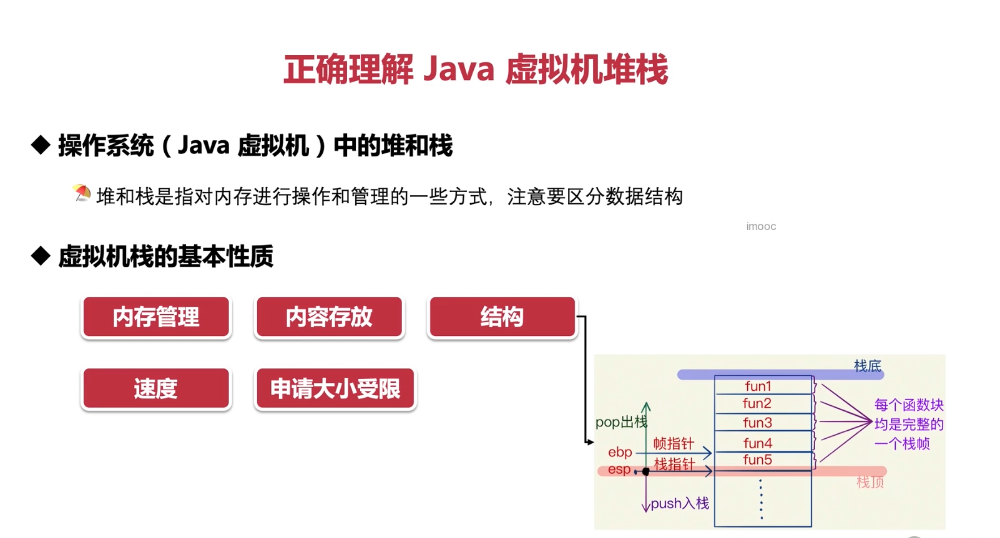
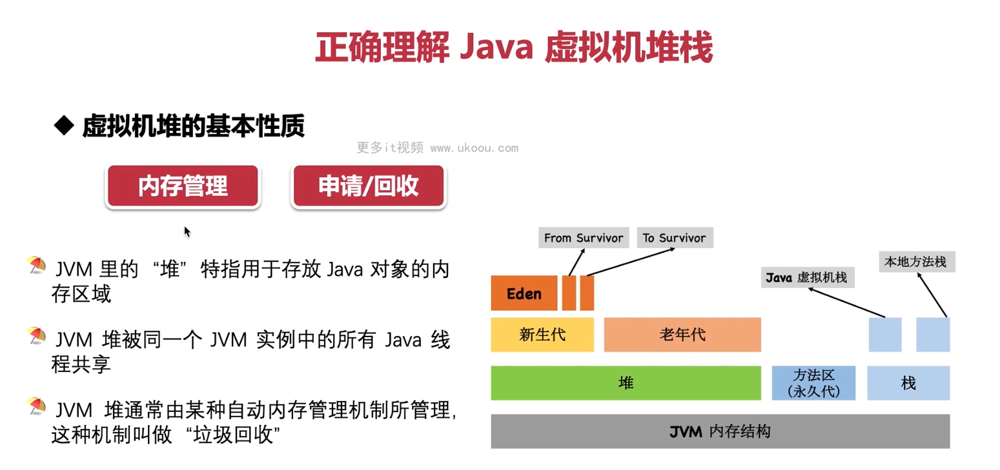
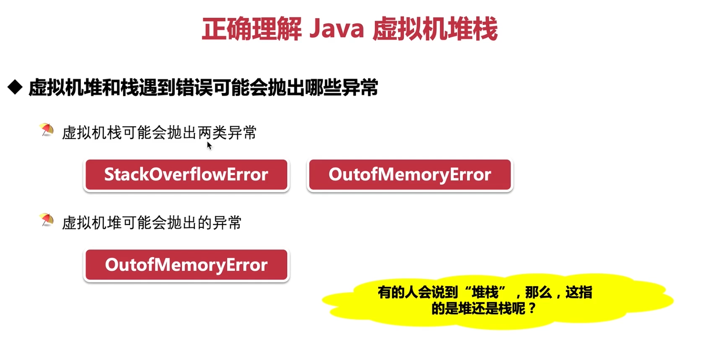

这张图片主要介绍了 Java 虚拟机（JVM）中的堆和栈的概念、基本性质以及结构。以下是对图片内容的详细解释：

### 正确理解 Java 虚拟机堆栈

- **操作系统（Java 虚拟机）中的堆和栈**：

  - 堆和栈是指对内存进行操作和管理的一些方式，注意要区分数据结构。

- **虚拟机栈的基本性质**：
  - 内存管理：栈是一种自动化的内存分配机制，它负责动态地分配和释放内存。
  - 内容存放：栈存储的是局部变量、函数调用等临时数据。
  - 结构：栈是一种后进先出（LIFO）的数据结构。
  - 速度：由于栈的操作简单且直接，所以访问速度快。
  - 申请大小受限：栈的大小有限制，一般由操作系统决定。

### 图片右侧的图解说明了栈的工作原理：

- 栈顶（Stack Top）：新添加的元素位于栈顶。
- 栈底（Stack Bottom）：最先添加的元素位于栈底。
- ESP（Stack Pointer）：栈指针，指向当前栈顶元素。
- EBP（Base Pointer）：基地址指针，始终指向当前活动记录的起始位置。
- push 入栈：将元素压入栈中，ESP 向下移动。
- pop 出栈：从栈中弹出元素，ESP 向上移动。

### 图片左侧的文字部分强调了堆和栈的区别：

- 数据结构：堆和栈是两种不同的数据结构，堆主要用于存储大块的复杂数据结构，而栈则用于存储临时数据和函数调用。
- 内存管理：堆需要手动管理内存，而栈由编译器自动管理。
- 速度：堆的访问速度较慢，因为需要搜索合适的空闲空间；而栈的访问速度较快，因为它采用固定大小的块进行分配。
- 申请大小：堆允许申请任意大小的内存，而栈的大小受到限制。

总的来说，这张图片旨在帮助读者理解 Java 虚拟机中的堆和栈的概念，以及它们各自的特点和用途。在编写 Java 程序时，正确理解和利用堆和栈可以帮助优化性能和内存使用效率。

这张图片主要介绍的是 Java 虚拟机（JVM）中的堆内存区域，以及它与其他内存区域的关系。以下是图片内容的详细解释：

### JVM 堆的基本性质

- **内存管理**：JVM 里的“堆”特指用于存放 Java 对象的内存区域。
- **申请/回收**：JVM 堆被同一个 JVM 实例中的所有 Java 线程共享。
- **垃圾回收**：JVM 堆通常由某种自动内存管理机制所管理，这种机制叫做“垃圾回收”。

### JVM 内存结构

JVM 内存结构分为以下几个部分：

- **新生代（Young Generation）**：新生代又分为 Eden 区和两个 Survivor 区（From Survivor 和 To Survivor），大部分对象首先在 Eden 区分配内存，当 Eden 区满时会触发 Minor GC，存活下来的对象会被转移到 Survivor 区之一。
- **老年代（Old Generation）**：经过多次 GC 仍然存活的对象会被移到老年代，老年代的空间比新生代更大，当老年代也满了之后会触发 Major GC（Full GC）。
- **永久代（Permanent Generation）**：在 Java 8 及以后版本中称为元空间（Metaspace），用于存储类的元数据，如类的名称、方法信息等。
- **方法区（Method Area）**：包含运行时常量池和静态变量等信息。
- **栈**：每个线程都有自己的栈，用于存储局部变量、方法调用等信息。

### 堆内存的作用

- 存放 Java 对象：JVM 堆是 Java 应用程序中所有对象的存储区域。
- 分享：堆内存被同一 JVM 实例中的所有 Java 线程共享，这意味着所有的线程都可以访问堆中的对象。
- 自动内存管理：通过垃圾回收机制，JVM 能够自动清理不再使用的对象，以防止内存泄漏。

### 垃圾回收

垃圾回收是一种自动内存管理机制，它负责识别不再使用的对象并将其从内存中清除，以便释放空间供新的对象使用。垃圾回收算法主要有标记-清除、复制、标记-整理和分代收集等。

### 总结

这张图片清晰地展示了 JVM 内存结构中的堆内存和其他内存区域之间的关系，以及堆内存的主要特点和作用。理解这些概念对于优化 Java 应用的性能和内存使用至关重要。

这张图片讨论了 Java 虚拟机（JVM）遇到错误时可能会抛出的异常类型，以及“堆栈”一词可能指的是哪一部分内存区域。

### 虚拟机栈和堆可能出现的错误

- **StackOverflowError**: 当虚拟机栈溢出时，会抛出此类错误。这通常是由于递归深度过深或者无限递归导致的。例如，在一个函数内部不断地调用自身，而又没有退出条件时，就会出现这种情况。
- **OutOfMemoryError**: 当虚拟机无法为新的请求分配足够的内存时，会抛出此类错误。这可能是由于栈或堆空间不足造成的。

### 虚拟机堆可能出现的错误

- **OutOfMemoryError**: 当堆空间耗尽时，会抛出此类错误。这通常是由于大量对象无法被垃圾回收，导致堆内存不足。
