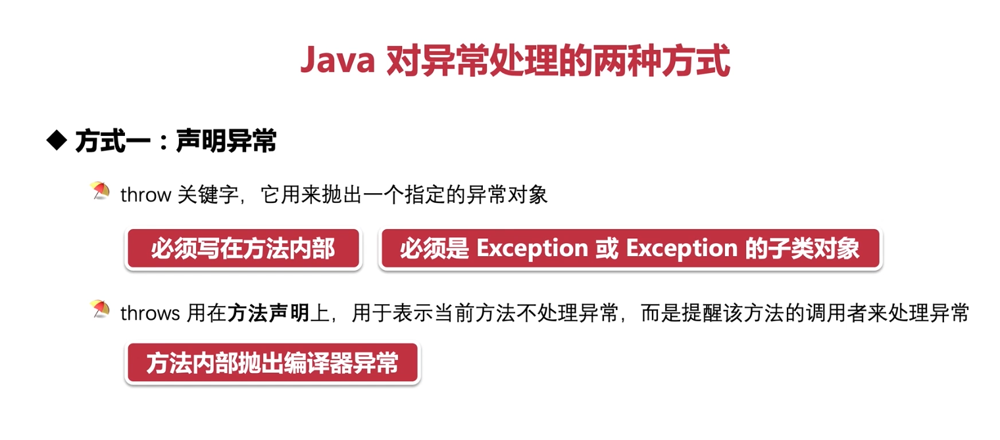
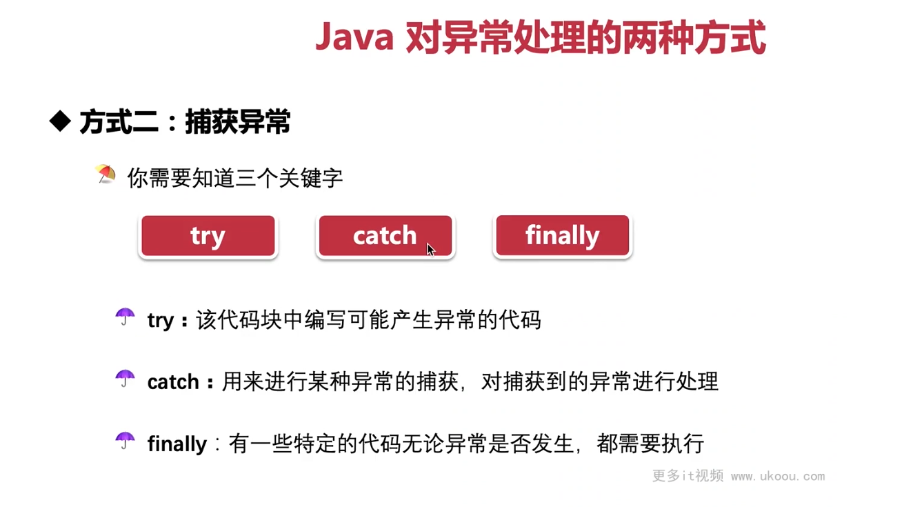

这张图片介绍了 Java 语言中处理异常的两种方式，即声明异常和捕获异常。

### 方式一：声明异常

1. 使用`throw`关键字来抛出一个指定的异常对象。这个关键字必须写在方法内部，并且抛出的异常对象必须是`Exception`或其子类的一个实例。
2. 使用`throws`关键字来表示当前方法不处理异常，而是将异常传递给调用者去处理。`throws`关键字用在方法声明上，表明该方法可能会抛出特定类型的异常。

### Java 异常处理概述

Java 中的异常处理是通过`try-catch-finally`语句块实现的。当代码块中发生异常时，可以使用`try`块来包围可能引发异常的代码，然后在`catch`块中处理异常。如果需要在方法级别进行异常处理，则可以在方法签名后使用`throws`关键字声明要抛出的异常类型。

### 异常分类

Java 中的异常分为检查型异常（checked exceptions）和运行时异常（unchecked exceptions）。检查型异常是指那些在编译阶段就需要处理的异常，比如文件未找到异常（FileNotFoundException）、空指针异常（NullPointerException）等。运行时异常则是在运行时才会发生的异常，如算术异常（ArithmeticException）、数组越界异常（ArrayIndexOutOfBoundsException）等。

### 编译器异常

编译器异常是指在编译期间就能检测到的异常，这类异常要求程序员要么在方法内部处理，要么在方法声明中使用`throws`关键字声明。如果不做任何处理，编译器将会报错。

### 总结

Java 提供了两种处理异常的方式：声明异常和捕获异常。声明异常主要用于告知调用者方法可能会抛出哪些异常；而捕获异常则是通过`try-catch-finally`语句块来对异常进行处理。正确地处理异常可以帮助开发者更有效地定位和解决程序中的问题，提高代码的健壮性和可靠性。


这张图片展示了 Java 语言中处理异常的第二种方式：捕获异常。Java 的异常处理机制主要基于关键词`try`、`catch`和`finally`。

### 关键字解释：

1. `try`: 这个关键字用于包含可能产生异常的代码块。当执行到`try`块中的代码时，如果发生了异常，那么控制流会立即转移到第一个匹配的`catch`块。

2. `catch`: 这个关键字后面跟着一个异常类作为参数，它定义了一个异常处理器。如果`try`块中产生了与`catch`参数类型相匹配的异常，那么对应的`catch`块就会被执行。每个`try`块都可以有多个`catch`块与之关联。

3. `finally`: 不管是否发生异常，`finally`块中的代码都会被执行。通常，`finally`块用于放置一些无论异常是否发生都需要执行的关键代码，如资源清理操作。

### 捕获异常的工作原理

当`try`块中的代码发生异常时，控制权会立即转移至相应的`catch`块。`catch`块根据异常的类型来决定是否处理该异常。如果找到了合适的`catch`块，那么就跳转到该块并执行其中的代码。如果没有找到匹配的`catch`块，那么异常将继续向上传递，直到找到合适的处理器为止。如果整个过程都没有找到适当的处理器，那么默认的行为就是终止程序。

### finally 块的重要性

`finally`块确保关键代码总是能够被执行，即使在异常情况下也是如此。例如，如果你在`try`块中打开了一个文件，那么你希望在任何时候都能关闭它，无论是正常完成还是因为异常而提前结束。这就是`finally`块的作用。

### 示例代码

```java
try {
    // 可能会产生异常的代码
} catch (IOException e) {
    // 处理 IOException 类型的异常
} catch (Exception e) {
    // 处理其他类型的异常
} finally {
    // 总是会执行的代码
}
```

### 结论

Java 的异常处理机制使得我们能够在程序运行时捕获和处理异常情况，从而提高了程序的稳定性和鲁棒性。通过合理使用`try`、`catch`和`finally`，我们可以编写出更加健壮的代码，以应对各种可能的问题。
