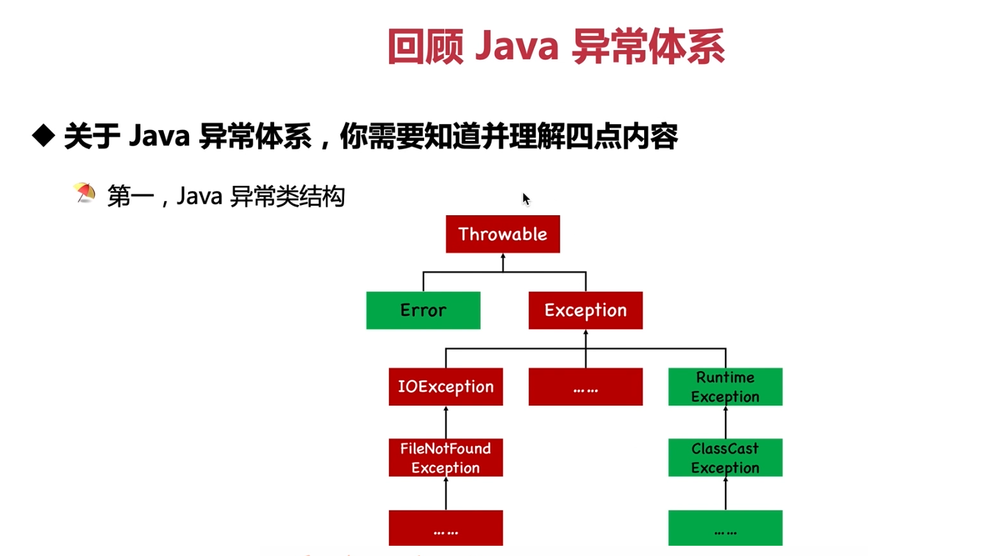
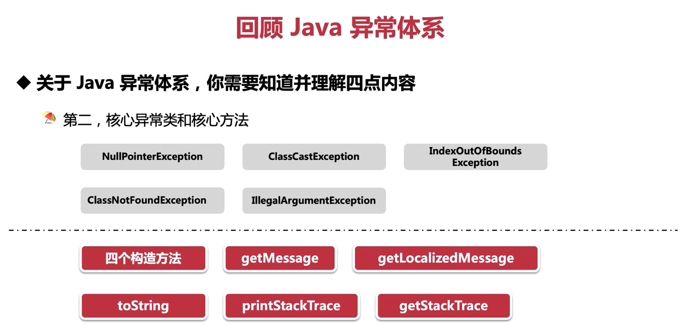
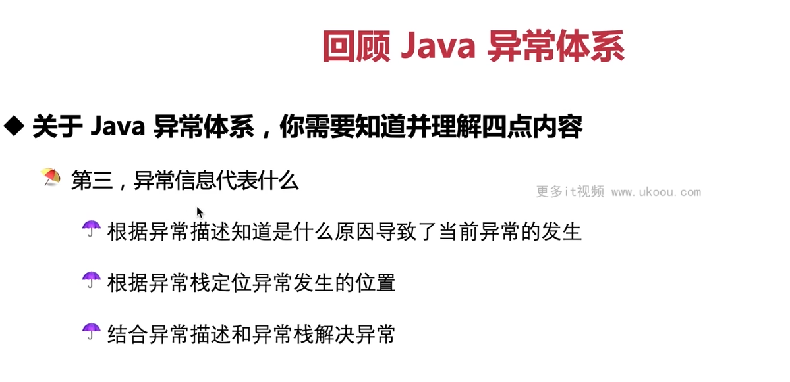
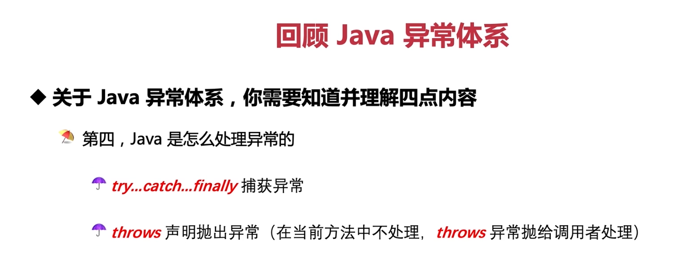

这张图展示的是 Java 异常处理的基本概念和异常体系结构。Java 异常处理是通过`Throwable`类及其子类实现的，这个类位于 Java 的核心库中。`Throwable`有两个主要的子类：`Error`和`Exception`，这两个类又各自拥有自己的子类。

- **Error**：表示严重的问题，这些问题超出了应用程序的控制范围，比如系统级问题、虚拟机错误等。这些错误通常不被捕获或处理，因为它们指示着一个程序无法恢复的情况。
- **Exception**：表示程序可以处理的异常事件，如文件找不到、网络连接失败等。`Exception`类有很多子类，包括`IOException`和`RuntimeException`等。

  - **Checked Exception**: 这些异常在编译阶段就需要处理，要么通过`try-catch`块捕获，要么通过`throws`声明传递给上层调用者。典型的例子是`IOException`，它是`Exception`的一个子类。

  - **Unchecked Exception**: 这些异常在运行时才会发现，它们是从`RuntimeException`派生出来的。这类异常通常由程序员错误引起，如数组越界、空指针异常等。

Java 异常处理的四个核心要素是：

1. **throw**：用来抛出异常对象。
2. **throws**：在方法签名后声明可能会抛出的异常，告诉调用者这个方法可能会抛出哪些异常。
3. **try**：包含可能发生异常的代码块。
4. **catch**：捕获特定类型的异常并提供处理逻辑。

此外，Java 还提供了`finally`块来确保某些代码无论如何都会执行，比如释放资源。

异常处理的目标是让程序在遇到错误时仍能保持运行，或者至少以可控的方式退出。通过捕获和处理异常，开发者可以在程序遇到问题时采取适当的动作，比如记录错误信息、显示用户友好的错误消息、回滚事务等。



这张图片展示了关于 Java 异常处理的一些关键点，主要包括以下内容：

1. **核心异常类**：Java 中的几个常见异常类型，包括`NullPointerException`（空指针异常）、`ClassCastException`（类型转换异常）、`ClassNotFoundException`（类未找到异常）和`IllegalArgumentException`（非法参数异常）。这些都是`RuntimeException`的子类，属于不受检查的异常，意味着它们不需要在方法签名中声明。

   - `NullPointerException`: 当对`null`引用调用方法或访问其属性时抛出。
   - `ClassCastException`: 在强制类型转换时发生，当试图将一个对象转换为其不兼容的类型时抛出。
   - `ClassNotFoundException`: 在加载类时找不到指定的类文件时抛出。
   - `IllegalArgumentException`: 当传入方法的参数不符合预期条件时抛出。

2. **核心方法**：这些是在处理异常时经常使用的几个方法。

   - **构造方法**：异常类有多个构造器用于创建异常实例，通常需要传入描述异常的信息字符串作为参数。
   - `getMessage()`: 返回异常的消息字符串，该消息通常包含了异常的原因。
   - `getLocalizedMessage()`: 获取本地化的异常消息，可以根据当前区域设置生成适合的语言环境的消息。
   - `toString()`: 将异常对象转换为字符串表示形式，通常包含异常的类名和消息。
   - `printStackTrace()`: 打印堆栈跟踪，即打印出引发异常的线程的当前调用堆栈信息。
   - `getStackTrace()`: 返回一个数组，其中包含有关引发异常的线程的堆栈跟踪元素。

这些方法对于理解和调试异常非常有用。例如，`printStackTrace()`方法可以帮助我们了解异常发生的上下文，找出问题所在的位置；`getMessage()`和`getLocalizedMessage()`则提供了异常的具体原因，帮助我们理解发生了什么问题。




这张图片强调了异常信息的重要性以及如何利用异常信息进行问题定位和解决。以下是关于异常信息的三个要点：

1. **异常描述**：异常描述通常是一个字符串，它解释了为什么会出现异常。当你看到一个异常时，首先应该查看它的描述，这有助于理解异常产生的原因。例如，`NullPointerException`的描述可能告诉你某个变量为`null`而你尝试对其进行操作，或者是`FileNotFoundException`说明你尝试打开的文件不存在。

2. **异常栈轨迹**：异常栈轨迹是一系列的函数调用，从最底层的触发异常的地方开始，到最顶层的调用者为止。每个条目代表了一个函数调用，包括函数名称、所属的类以及行数。异常栈轨迹让你知道异常在哪一行代码中产生，从而能够快速定位到问题所在的代码位置。

3. **结合异常描述和异常栈解决异常**：有了异常描述和异常栈轨迹，你就可以分析问题的根本原因并着手解决问题。异常描述告诉你问题是什么，异常栈轨迹告诉你问题在哪里。根据这些信息，你可以修改代码以避免同样的问题再次发生。

例如，如果你遇到了`NullPointerException`，异常描述会告诉你哪个变量为`null`，然后你可以检查代码，看看为什么那个变量没有被初始化或者为什么值变成了`null`。再结合异常栈轨迹，你可以确定哪一行代码引发了这个问题，然后修复它。




这张图片介绍了Java中处理异常的两种基本方式：使用`try...catch...finally`语句块捕获异常和使用`throws`关键字声明抛出异常。

1. **try...catch...finally**：这是Java中处理异常的主要机制。`try`块包含可能出现异常的代码，如果在`try`块内出现异常，相应的`catch`块会被执行。`catch`块定义了要捕获的异常类型，并提供了一段代码来处理这种类型的异常。`finally`块无论是否发生异常都会被执行，通常用于清理资源或执行一些必须的操作。例如：

```java
try {
    // 可能抛出异常的代码
} catch (IOException e) {
    // 处理 IOException 的代码
} finally {
    // 总是执行的代码，如关闭流
}
```

2. **throws**：如果一个方法不能处理一个检査性异常，那么该方法可以声明抛出异常，这样调用这个方法的方法就必须处理这个异常。`throws`关键字放在方法签名后面，后面跟着要抛出异常的列表。例如：

```java
public void readFile() throws IOException {
    // 如果读取文件过程中出现异常，则抛出 IOException
}
```

在这个例子中，`readFile()`方法不会处理`IOException`，而是将其抛给调用者。调用`readFile()`的方法必须处理这个异常，或者继续抛出它，直到有一个地方处理它。

总的来说，异常处理允许你在程序中检测和响应错误，而不必终止整个程序。通过捕获和处理异常，你可以提供更优雅的错误报告，而不是简单地崩溃。同时，`throws`关键字允许你将责任转移给调用你的代码，以便更高层次的代码可以决定如何处理异常。

