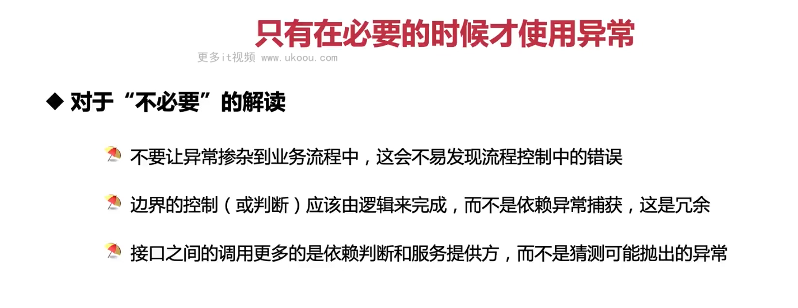

这张图片强调了在编程中合理使用异常的重要性。异常应该只在必要的情况下使用，不应该滥用。下面是关于“不必要的”解读的三点：

1. **不要让异常掺杂到业务流程中**：异常通常是用来处理非正常情况的，比如文件未找到或网络连接失败等。如果在正常的控制流程中使用异常，会使代码难以阅读和维护。你应该尽量保持业务逻辑清晰，只有在遇到不可预见的问题时才使用异常。

2. **边界控制应由逻辑完成**：异常不是用来处理常规的控制流程的，例如检查输入的有效性。你应该在代码中添加适当的逻辑来验证输入，而不是依赖于捕获可能的异常。这样做可以使代码更加可预测且易于测试。

3. **接口间的调用依赖于判断和服务提供方**：在设计 API 或服务接口时，你应该明确指出期望的行为，而不是假设可能会抛出哪些异常。客户端应该基于提供的文档或契约来编写代码，而不是猜测可能的异常。这样可以提高代码的健壮性和可维护性。

总之，异常是用来处理意外情况的工具，而不是主要的控制结构。过度使用异常会导致代码复杂度增加，降低可读性和可维护性。在编程时，你应该尽可能使用正常的控制流程来处理常见的错误情况，仅在确实无法预料的情况发生时使用异常。
