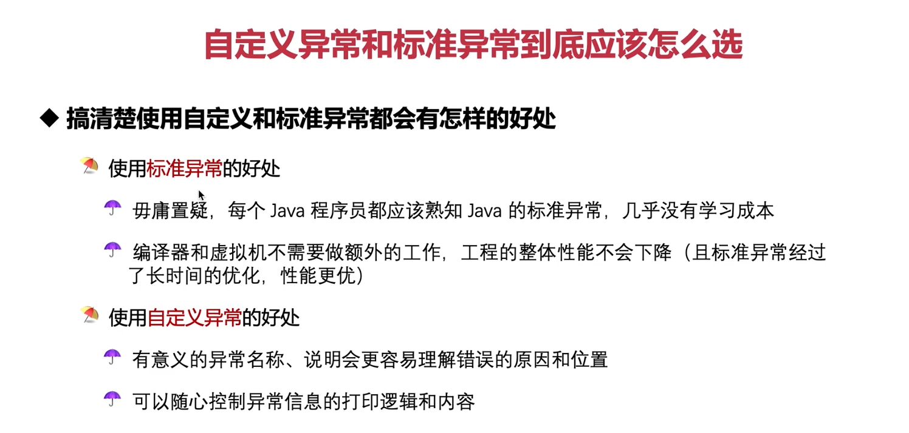
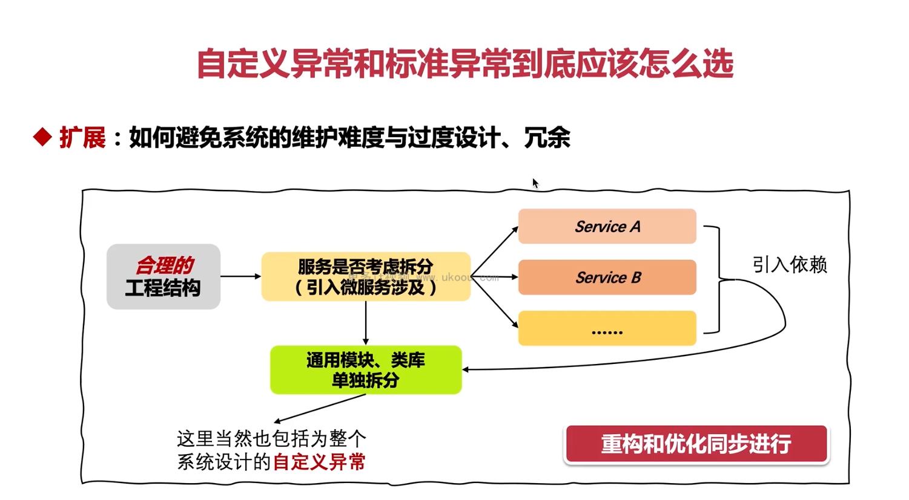

首先，我们来看一个使用标准异常的例子：

```java
import java.io.IOException;

public class StandardExceptionExample {

    public static void main(String[] args) throws IOException {
        try {
            readFile("non_existent_file.txt");
        } catch (IOException e) {
            System.out.println("An exception occurred while reading the file: " + e.getMessage());
        }
    }

    public static void readFile(String fileName) throws IOException {
        throw new IOException("File does not exist.");
    }
}
```

在这个例子中，我们使用了标准异常 `IOException` 来表示文件读取操作失败的情况。好处包括：

1. 每个 Java 程序员都熟悉 `IOException`，所以几乎没有任何学习成本。
2. 编译器和虚拟机无需额外工作，整体性能不会下降。

接下来，我们看一个使用自定义异常的例子：

```java
public class CustomException extends Exception {
    public CustomException(String message) {
        super(message);
    }
}

public class CustomExceptionExample {

    public static void main(String[] args) {
        try {
            readFile("non_existent_file.txt");
        } catch (CustomException e) {
            System.out.println("An exception occurred while reading the file:");
            System.out.println(e.getMessage());
        }
    }

    public static void readFile(String fileName) throws CustomException {
        if (!fileExists(fileName)) {
            throw new CustomException("File does not exist.");
        }
    }

    private static boolean fileExists(String fileName) {
        // 在实际应用中，你需要在这里编写逻辑来检查文件是否存在
        return false;
    }
}
```

在这个例子中，我们创建了一个名为 `CustomException` 的自定义异常类，并且在 `readFile` 方法中抛出了这个异常。自定义异常的好处包括：

1. 更有意义的异常名称，如 `CustomException`，更容易理解错误的原因和位置。
2. 我们可以根据需要控制异常信息的打印逻辑和内容。

注意，在实际的应用中，你应该在 `fileExists` 方法中添加适当的逻辑来检查文件是否存在。这里的示例只是为了演示如何使用自定义异常。

总结一下，标准异常和自定义异常各有优缺点。在某些情况下，使用标准异常可能更为方便，而在另一些情况下，自定义异常可能会提供更好的可读性和可控性。在实际项目中，应根据具体情况选择合适的异常类型。



这张图片描述了如何避免系统维护难度、过度设计和冗余，同时选择了自定义异常和标准异常。以下是基于此图的一些指导原则和示例代码：

1. **合理的工程结构**：

   - 使用模块化和分层架构来组织代码，每个模块专注于特定的功能或任务。
   - 服务之间尽量减少依赖关系，以降低耦合度。

2. **服务是否考虑拆分（引入微服务涉及）**：

   - 如果服务变得过于庞大，可以考虑将其拆分为多个较小的服务，每个服务都有自己的职责。
   - 使用 RESTful API 或其他通信协议进行服务之间的交互。

3. **通用模块、类库单独拆分**：

   - 将公共功能提取出来，形成独立的模块或类库，便于复用和维护。

4. **重构和优化同步进行**：

   - 在开发新功能的同时，不断审视现有代码，寻找可以改进的地方，进行重构和优化。

5. **自定义异常的设计**：
   - 自定义异常应该具有明确的目的和用途，不要过度设计。
   - 在必要时，为整个系统设计自定义异常，但要确保它们易于理解和使用。

以下是一个简单的示例，展示了如何遵循这些原则来设计一个简单的微服务架构：

```java
// Service A
public interface ServiceA {
    String doSomething();
}

@Service
public class ServiceAImpl implements ServiceA {
    @Override
    public String doSomething() {
        // ...
        throw new ServiceAException("Service A failed.");
    }
}

class ServiceAException extends RuntimeException {
    public ServiceAException(String message) {
        super(message);
    }
}

// Service B
public interface ServiceB {
    String doSomethingElse();
}

@Service
public class ServiceBImpl implements ServiceB {
    private final ServiceA serviceA;

    public ServiceBImpl(ServiceA serviceA) {
        this.serviceA = serviceA;
    }

    @Override
    public String doSomethingElse() {
        try {
            serviceA.doSomething();
        } catch (ServiceAException e) {
            // 处理来自 Service A 的异常
        }
        // ...
    }
}
```

在这个例子中，我们有两个服务：`ServiceA` 和 `ServiceB`。`ServiceA` 抛出自定义异常 `ServiceAException`，`ServiceB` 使用 `ServiceA` 的服务，并捕获可能出现的异常。

遵循以上原则，我们可以做到：

- 保持良好的工程结构，每个服务专注于自己的职责。
- 如果有必要，可以将 `ServiceA` 和 `ServiceB` 拆分成单独的服务。
- 公共模块（如异常处理）可以单独抽取出来，以便在整个系统中复用。
- 在开发过程中持续关注代码质量，进行必要的重构和优化。

记住，选择自定义异常或标准异常取决于具体场景。在某些情况下，标准异常可能足够；但在其他情况下，自定义异常可以帮助提高代码的可读性和可维护性。
