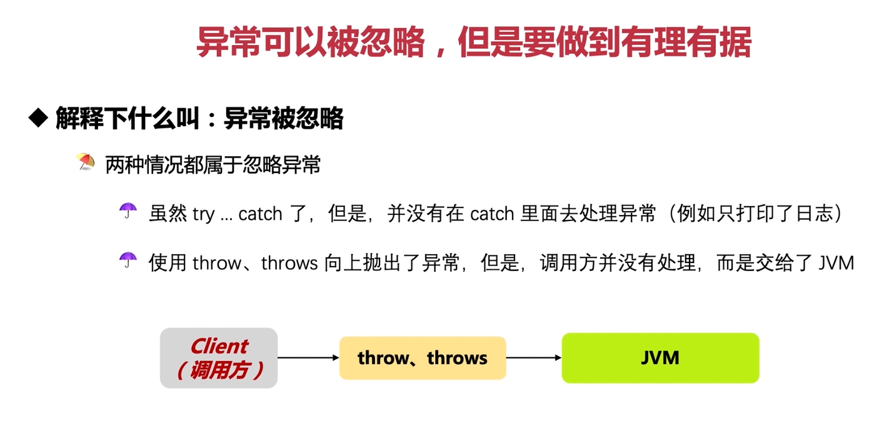

在这张图片中，讨论了两种情况下的异常被忽略，以及如何合理地忽略异常。下面是这两种情况的具体解释和示例代码：

1. **虽然 try ... catch 了，但是并没有在 catch 里面去处理异常（例如只打印了日志）**:

在这种情况下，开发者在 `try-catch` 结构中捕获了异常，但并未采取任何实质性的措施来处理异常，只是简单地记录日志或者显示错误信息。这可能导致程序继续运行，但没有解决根本问题。在某些情况下，这是可以接受的，比如在非关键路径上出现的预期异常。然而，大多数情况下，我们应该尽可能地处理异常，修复问题或至少提供一种优雅的降级策略。

```java
public class Example {
    public static void main(String[] args) {
        try {
            // 这里可能发生异常的操作
            someMethodThatMightThrowException();
        } catch (Exception e) {
            // 只打印日志，但没有进一步处理
            System.out.println("An exception occurred: " + e.getMessage());
        }
    }

    private static void someMethodThatMightThrowException() throws Exception {
        // ...
        throw new Exception("Some exception occurred.");
    }
}
```

2. **使用 throw、throws 向上调出了异常，但是调用方并没有处理，而是交给了 JVM**:

在这种情况下，一个方法声明了它可能会抛出某种类型的异常，但调用者没有捕获并处理这些异常。这可能导致程序崩溃，因为 JVM 无法自动处理所有类型的异常。为了避免这种情况，调用者应该要么捕获并处理异常，要么将异常传递给更高层次的方法，直到找到能够正确处理异常的地方。

```java
public class Example {
    public static void main(String[] args) {
        // 调用可能抛出异常的方法，但没有捕获异常
        someMethodThatThrowsException();
    }

    private static void someMethodThatThrowsException() throws Exception {
        // ...
        throw new Exception("Some exception occurred.");
    }
}
```

在实际开发中，我们需要谨慎对待异常处理。尽管有时候忽略异常可能是合理的，但我们必须确保我们的应用程序能够在发生异常时仍能正常运行。以下是一些建议：

- **记录异常**：即使你不打算立即处理异常，也应该记录下异常的信息，这样可以在出现问题时帮助诊断。
- **提供降级策略**：如果某个操作可能会导致异常，那么最好有一个降级策略，以便在异常发生时也能提供基本的服务。
- **向上抛出异常**：如果一个方法无法处理异常，它可以向上抛出异常，由调用者决定如何处理。但是，调用者不应该忽视这些异常，除非它确信自己知道如何处理。

总之，异常处理是一项重要的任务，需要仔细考虑。在忽略异常之前，务必确保已经充分评估了后果，并且有理由相信这样做是安全的。
