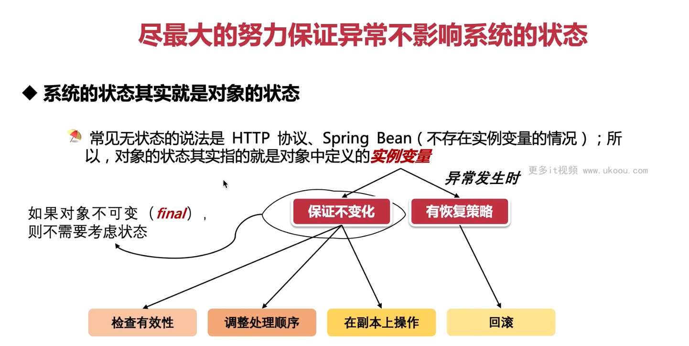

这张图片强调了在处理异常时，尽最大努力保证系统的状态不受影响的重要性。下面是一些相关的建议和示例代码：

1. **检查有效性**：
   - 在执行操作前验证输入参数的有效性，防止无效数据引发异常。

```java
public class Example {
    public void process(int input) {
        if (input <= 0) {
            throw new IllegalArgumentException("Input must be positive.");
        }
        // 执行操作...
    }
}
```

2. **调整处理顺序**：
   - 如果某些操作可能会引起异常，可以先执行那些不太可能出错的操作，再执行可能出错的操作。

```java
public class Example {
    public void process() {
        try {
            // 首先执行不太可能出错的操作
            performLessRiskyOperation();

            // 接着执行可能出错的操作
            performRiskierOperation();
        } catch (Exception e) {
            // 处理异常
        }
    }
}
```

3. **在副本上操作**：
   - 如果可能的话，对原始对象的副本进行操作，而不是直接修改原始对象。这样，即使操作失败，也不会影响原始对象的状态。

```java
public class Example {
    public void process(Object originalObject) {
        Object copy = createCopy(originalObject);

        try {
            // 在副本上操作
            modify(copy);
        } catch (Exception e) {
            // 处理异常
        }

        // 如果成功，更新原始对象
        updateOriginalObject(originalObject, copy);
    }
}
```

4. **回滚**：
   - 如果操作涉及到事务管理，确保在异常发生时回滚事务，恢复到初始状态。

```java
@Transactional
public class Example {
    public void process() {
        try {
            // 开始事务
            // ...

            // 执行操作
            // ...

            // 提交事务
        } catch (Exception e) {
            // 回滚事务
            throw new RuntimeException("Failed to complete operation.", e);
        }
    }
}
```

5. **对象不可变**：
   - 如果对象是不可变的（`final`），则不需要担心异常会影响其状态。例如，`String` 类就是不可变的。

```java
public final class ImmutableExample {
    private final int value;

    public ImmutableExample(int value) {
        this.value = value;
    }

    public int getValue() {
        return value;
    }
}
```

6. **恢复策略**：
   - 当异常发生时，可以尝试通过备份或重试等手段恢复系统状态。

```java
public class Example {
    public void process() {
        try {
            // 执行操作
        } catch (Exception e) {
            // 恢复策略
            recoverFromFailure();
        }
    }

    private void recoverFromFailure() {
        // 例如，从备份恢复数据
        // 或者重试操作
    }
}
```

总的来说，为了保证系统的稳定性，我们需要在处理异常时考虑到对象的状态。通过检查有效性、调整处理顺序、在副本上操作、回滚事务等方式，我们可以尽力确保异常不会影响系统的状态。对于不可变对象，由于它们的状态不会改变，因此不需要特别处理。


