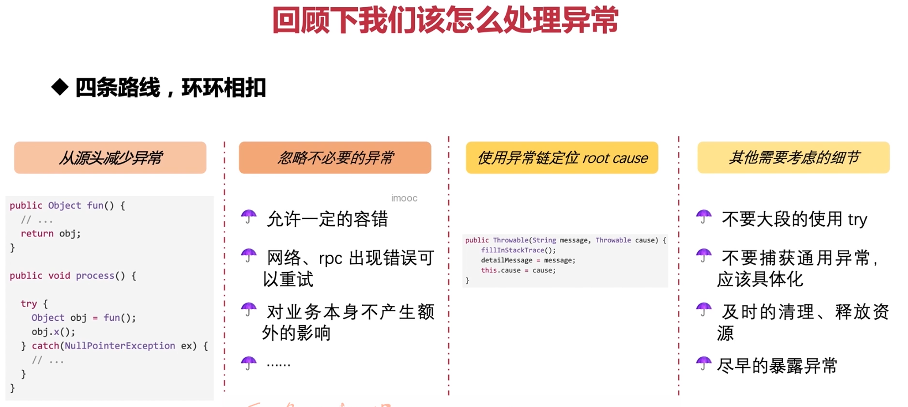

这张图片概述了处理异常的四个主要方面，让我们逐一分析每一点，并给出相应的 Java 示例代码：

1. **从源头减少异常**：
   - 通过编写健壮的代码来减少异常的发生。例如，避免空指针异常：

```java
public class Example {
    public void process() {
        try {
            Object obj = fun();
            if (obj != null) {
                obj.x(); // 如果 obj 是 null，则会抛出 NullPointerException
            }
        } catch (NullPointerException ex) {
            // 异常处理
        }
    }

    public Object fun() {
        // 返回值可能为 null 的方法
        return null; // 替换为实际的实现
    }
}
```

2. **忽略不必要的异常**：
   - 对于某些异常，可以选择忽略，特别是当它们对业务本身不产生额外的影响时。例如，网络或 RPC 错误可以重试：

```java
public class Example {
    public void process() {
        for (int i = 0; i < 3; i++) { // 最多重试三次
            try {
                // 发送请求
                sendRequest();
                break; // 成功后跳出循环
            } catch (NetworkException ex) {
                // 失败后等待一段时间再重试
                Thread.sleep(1000); // 等待一秒
            }
        }
    }

    private void sendRequest() throws NetworkException {
        // 实际发送网络请求的代码
    }
}
```

3. **使用异常链定位 root cause**：
   - 使用异常链可以更清晰地展示异常的根源。例如，你可以创建一个新的异常，并设置原始异常作为原因：

```java
public class Example {
    public void process() {
        try {
            // 执行操作
        } catch (IOException e) {
            throw new MyException("MyException occurred", e);
        }
    }
}

class MyException extends Exception {
    public MyException(String message, Throwable cause) {
        super(message, cause);
    }
}
```

4. **其他需要考虑的细节**：
   - 不要大段地使用 `try-catch`，而应该具体化异常处理：
     ```java
     public class Example {
         public void process() {
             try {
                 // 执行操作
             } catch (FileNotFoundException e) {
                 // 文件未找到的处理
             } catch (IOException e) {
                 // 其他 I/O 错误的处理
             }
         }
     }
     ```
   - 及时清理和释放资源：
     ```java
     public class Example {
         public void process() {
             InputStream in = null;
             try {
                 in = new FileInputStream("file.txt");
                 // 使用流
             } finally {
                 if (in != null) {
                     in.close();
                 }
             }
         }
     }
     ```
   - 尽早暴露异常：
     ```java
     public class Example {
         public void process() {
             if (checkPreconditions()) {
                 // 执行操作
             } else {
                 throw new InvalidStateException("Invalid state.");
             }
         }

         private boolean checkPreconditions() {
             // 检查预条件
         }
     }
     ```

综上所述，处理异常的最佳实践包括减少异常的发生、明智地忽略某些异常、使用异常链追踪根因以及考虑其他细节，如具体化的异常处理、及时清理资源和尽早暴露异常。这些做法有助于提高代码的质量和可靠性。