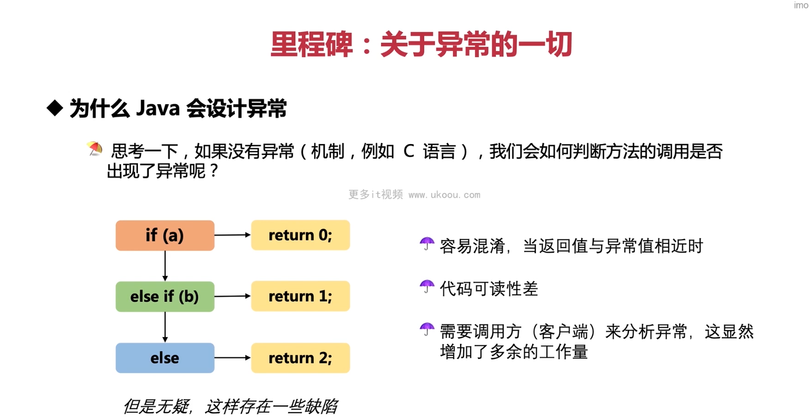
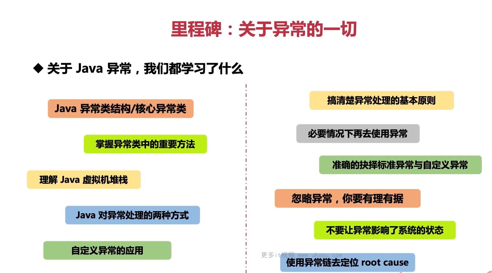

这张图片说明了为什么 Java 设计了异常机制。如果没有异常机制，我们需要通过返回值来判断方法调用是否出现了问题。以下是一个 C 语言的例子，演示了这种模式：

```c
#include <stdio.h>

int divide(int a, int b) {
    if (b == 0) {
        return 0; // 表示除数为零的情况
    } else if (a % b == 0) {
        return 1; // 表示整除的情况
    } else {
        return 2; // 正常除法结果
    }
}

int main() {
    printf("%d\n", divide(10, 0)); // 输出 0
    printf("%d\n", divide(10, 2)); // 输出 1
    printf("%d\n", divide(10, 3)); // 输出 3

    return 0;
}
```

这个 C 语言的函数 `divide` 并没有抛出异常，而是根据不同的情况进行不同类型的返回值。然而，这样的做法存在一些问题：

1. **容易混淆**：当返回值与异常值相近时，很难区分正常的返回值和异常情况。例如，在上述代码中，`return 0` 可能表示除数为零，也可能表示计算结果恰好等于零。
2. **代码可读性差**：为了理解代码的意图，读者需要查看整个函数的逻辑，才能明白各种返回值的意义。
3. **需要调用方分析异常**：客户端代码需要解析返回值，以确定是否存在异常情况，增加了额外的工作量。

相比之下，Java 中的异常处理更加直观和易于理解。以下是一个使用 Java 异常处理的例子：

```java
public class Example {
    public static void main(String[] args) {
        try {
            System.out.println(divide(10, 0)); // 输出：ArithmeticException: / by zero
        } catch (ArithmeticException e) {
            e.printStackTrace();
        }
    }

    public static int divide(int a, int b) {
        if (b == 0) {
            throw new ArithmeticException("/ by zero"); // 抛出异常
        } else {
            return a / b;
        }
    }
}
```

在这个 Java 示例中，`divide` 方法在遇到除数为零的情况下抛出 `ArithmeticException`，而不是返回一个特殊的值。调用方可以通过 `try-catch` 块捕获并处理异常，从而提高了代码的可读性和可维护性。此外，异常类型提供了更多的上下文信息，使得调试更容易。



这张图片总结了关于 Java 异常的一些关键知识点。以下是每个部分的详细解释和相关代码示例：

1. **Java 异常类结构/核心异常类**：

   - Java 异常类继承自 `Throwable` 类，其中有两个重要的子类：`Error` 和 `Exception`。`Error` 表示严重的问题，通常由 JVM 自动处理；`Exception` 则用于程序中的错误，可以被程序员捕获和处理。以下是一个简单的例子：

     ```java
     try {
         throw new Error("This is an error.");
     } catch (Error e) {
         e.printStackTrace();
     }

     try {
         throw new Exception("This is an exception.");
     } catch (Exception e) {
         e.printStackTrace();
     }
     ```

2. **掌握异类中的重要方法**：

   - 异常类包含了一些有用的方法，比如 `getMessage()` 获取异常消息，`getStackTrace()` 获取堆栈跟踪信息。以下是如何使用这些方法的一个简单示例：

     ```java
     try {
         throw new Exception("An exception occurred.");
     } catch (Exception e) {
         System.out.println(e.getMessage()); // 输出 "An exception occurred."
         e.getStackTrace()[0].printStackTrace(); // 输出堆栈跟踪信息
     }
     ```

3. **理解 Java 虚拟机堆栈**：

   - Java 虚拟机堆栈记录了方法调用的过程。当出现异常时，堆栈跟踪可以帮助我们了解异常发生的上下文。以下是一个显示堆栈跟踪的示例：

     ```java
     try {
         throw new Exception();
     } catch (Exception e) {
         e.printStackTrace(); // 输出堆栈跟踪信息
     }
     ```

4. **Java 对异常处理的两种方式**：

   - Java 支持两种异常处理方式：`try-catch-finally` 和 `try-with-resources`。以下是一个使用 `try-catch-finally` 的例子：

     ```java
     try {
         FileReader fr = new FileReader("non_existent_file.txt");
         BufferedReader br = new BufferedReader(fr);
         String line = br.readLine();
     } catch (FileNotFoundException e) {
         e.printStackTrace();
     } catch (IOException e) {
         e.printStackTrace();
     } finally {
         // 这里总是会被执行
     }
     ```

     下面是一个使用 `try-with-resources` 的例子：

     ```java
     try (BufferedReader br = new BufferedReader(new FileReader("non_existent_file.txt"))) {
         String line = br.readLine();
     } catch (IOException e) {
         e.printStackTrace();
     }
     ```

5. **自定义异常的应用**：

   - 我们可以创建自己的异常类，以便更好地描述特定的错误情况。以下是一个自定义异常的示例：

     ```java
     class CustomException extends Exception {
         public CustomException(String message) {
             super(message);
         }
     }

     public void process() {
         try {
             throw new CustomException("Custom exception occurred.");
         } catch (CustomException e) {
             e.printStackTrace();
         }
     }
     ```

6. **准确的抉择标准异常与自定义异常**：

   - 标准异常已经包含了常见的错误情况，但在必要时也可以创建自定义异常。以下是一个使用标准异常的例子：

     ```java
     public void process() {
         try {
             int result = Integer.parseInt("abc");
         } catch (NumberFormatException e) {
             e.printStackTrace();
         }
     }
     ```

7. **忽略异常，你要有理有据**：

   - 忽略异常时应谨慎，确保你知道自己在做什么。以下是一个忽略异常的例子：

     ```java
     try {
         // 可能抛出 IOException 的操作
     } catch (IOException ignored) {}
     ```

8. **不要让异常影响了系统的状态**：

   - 通过合理的异常处理，确保异常不会破坏系统的稳定。以下是一个示例：

     ```java
     public void process() {
         try {
             // 可能抛出异常的操作
         } catch (Exception e) {
             // 记录日志、通知用户或其他适当的处理
         }
     }
     ```

9. **使用异常链去定位 root cause**：

   - 异常链帮助我们追踪异常的根本原因。以下是一个使用异常链的例子：

     ```java
     try {
         throw new Exception("Outer exception");
     } catch (Exception outer) {
         try {
             throw new Exception("Inner exception", outer);
         } catch (Exception inner) {
             System.out.println(inner.getCause()); // 输出 Outer exception
         }
     }
     ```

以上内容涵盖了 Java 异常处理的基本知识，包括异常类结构、重要方法、虚拟机堆栈、处理方式、自定义异常以及如何正确处理和利用异常。学习这些概念将使你能够更好地理解和处理 Java 应用程序中的异常情况。


这张图片强调了日志记录的重要性，特别是在处理异常时。以下是一些关于日志记录的关键点及其对应的 Java 代码示例：

1. **把工程中的异常信息记录到日志中**：

   - 在 Java 中，我们可以使用日志框架（如 Logback 或 Log4j）来记录异常信息。以下是一个使用 Logback 的简单示例：

     ```java
     import org.slf4j.Logger;
     import org.slf4j.LoggerFactory;

     public class Example {
         private static final Logger logger = LoggerFactory.getLogger(Example.class);

         public void process() {
             try {
                 // 可能抛出异常的操作
             } catch (Exception e) {
                 logger.error("An error occurred.", e);
             }
         }
     }
     ```

2. **把业务流程信息记录到日志中**：

   - 除了记录异常，还可以记录业务流程的信息，以便了解程序的执行过程。以下是一个示例：

     ```java
     public class Example {
         private static final Logger logger = LoggerFactory.getLogger(Example.class);

         public void process() {
             logger.info("Starting the process...");
             // 执行业务流程
             logger.info("Process completed successfully.");
         }
     }
     ```

3. **通过日志查看、分析用户行为**：

   - 日志可以帮助我们了解用户的操作。例如，我们可以记录用户登录事件：

     ```java
     public class Example {
         private static final Logger logger = LoggerFactory.getLogger(Example.class);

         public void login(String username, String password) {
             if (authenticate(username, password)) {
                 logger.info("{} logged in successfully.", username);
             } else {
                 logger.warn("{} failed to log in.", username);
             }
         }

         private boolean authenticate(String username, String password) {
             // 验证用户名和密码的逻辑
         }
     }
     ```

4. **审计功能**：

   - 日志可用于审计目的，例如记录敏感操作。以下是一个示例：

     ```java
     public class Example {
         private static final Logger logger = LoggerFactory.getLogger(Example.class);

         public void transferMoney(String fromAccount, String toAccount, double amount) {
             // 转账逻辑
             logger.info("Transfered {} from {} to {}", amount, fromAccount, toAccount);
         }
     }
     ```

通过合理地记录日志，我们可以更好地理解程序的行为，快速定位问题，并进行审计等任务。在实际项目中，通常会结合日志级别（如 `DEBUG`、`INFO`、`WARN` 和 `ERROR`）来控制输出的内容。同时，也会使用日志框架提供的格式化字符串和参数化日志语句，以便更高效地生成和搜索日志。
