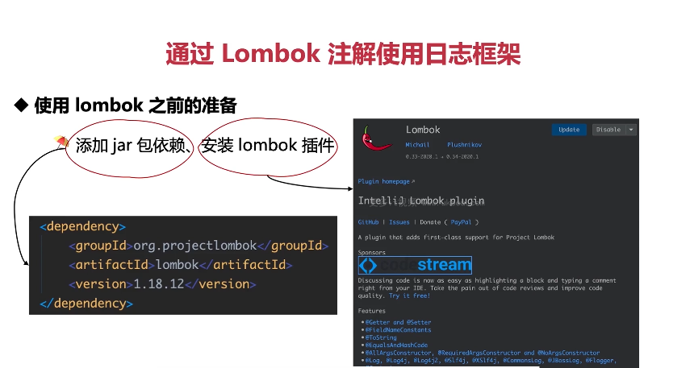
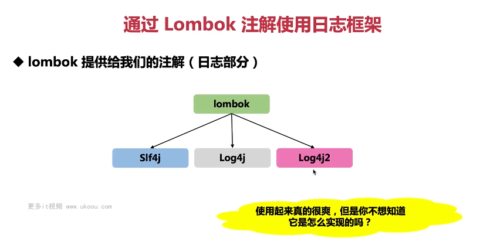
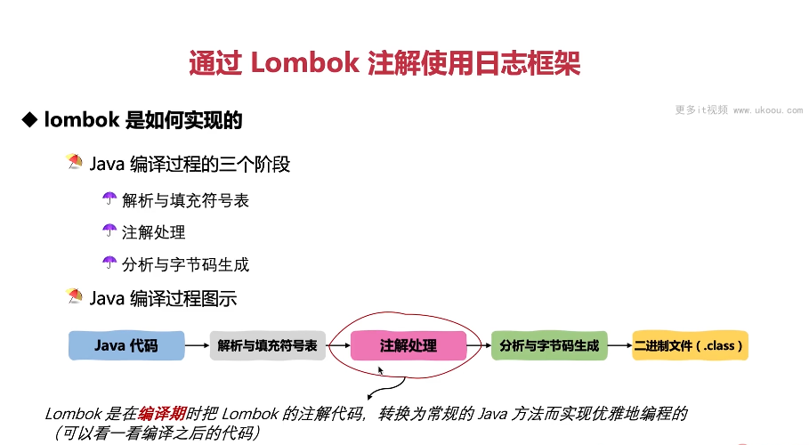
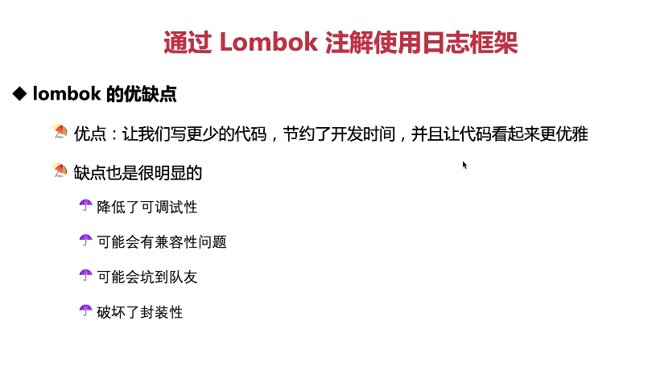

这张图片介绍了如何通过Lombok注解来简化日志框架的使用。Lombok是一个开源项目，它提供了一系列注解，能够自动生成常见的Java代码，比如getter、setter、equals、hashCode、toString等等，从而减少冗余代码。对于日志框架而言，Lombok也提供了@Log系列注解，可以方便地生成日志相关的代码。

以下是使用Lombok注解的一些步骤：

1. **添加jar包依赖**：在Maven项目的pom.xml文件中添加Lombok的依赖：
   ```xml
   <dependency>
       <groupId>org.projectlombok</groupId>
       <artifactId>lombok</artifactId>
       <version>1.18.12</version>
   </dependency>
   ```

2. **安装Lombok插件**：如果你使用IntelliJ IDEA，可以在插件市场搜索并安装Lombok插件，这样IDE就能识别和高亮显示Lombok注解。

接下来，我们来看一个使用Lombok @Log注解的简单示例：

```java
import lombok.AllArgsConstructor;
import lombok.Getter;
import lombok.NoArgsConstructor;
import lombok.Setter;

@Getter
@Setter
@NoArgsConstructor
@AllArgsConstructor
public class User {

    @Log
    private String username;
    private int age;
    private String email;
}
```

在这个例子中，我们使用了Lombok的`@Getter`, `@Setter`, `@NoArgsConstructor`和`@AllArgsConstructor`注解来自动生成对应的getter和setter方法，以及无参构造函数和全参构造函数。同时，我们还在类上使用了`@Log`注解，这相当于声明了一个名为"log"的Logger变量，可以直接使用。

现在，你就可以像下面这样使用日志了：

```java
User user = new User("Alice", 25, "alice@example.com");
log.info("New user created with username: {}, age: {}, email: {}", user.getUsername(), user.getAge(), user.getEmail());
```

注意，由于Lombok只是在编译期生成代码，所以在运行时不会看到`@Log`注解。你需要确保你的编译工具（如Maven或Gradle）正确配置了Lombok的处理器。

总结起来，Lombok能极大地简化Java开发，减少不必要的样板代码。通过合理使用Lombok注解，我们可以更专注于业务逻辑，而不是重复的手动编写getter、setter等辅助方法。



这张图片展示了Lombok提供的日志相关注解，主要分为三个部分：SLF4J、Log4j和Log4j2。这些注解帮助我们在Java代码中轻松地创建和使用日志。

1. **SLF4J**：Lombok提供了`@Log`, `@Log4j`, `@Log4j2`, `@Slf4j`, `@XSlf4j`等注解，它们都是对SLF4J接口的封装。使用这些注解后，Lombok会在编译期间自动生成一个实现了SLF4J接口的日志对象，你可以直接使用。

2. **Log4j**：Lombok提供了`@Log`, `@Log4j`, `@Log4j2`注解，它们分别对应了Log4j、Log4j2的不同实现。使用这些注解后，Lombok会在编译期间自动生成一个实现了Log4j或Log4j2接口的日志对象，你可以直接使用。

3. **Log4j2**：Lombok提供了`@Log4j2`注解，它是专门针对Log4j2的。使用这个注解后，Lombok会在编译期间自动生成一个实现了Log4j2接口的日志对象，你可以直接使用。

以下是一个使用Lombok注解的简单示例：

```java
import org.slf4j.Logger;
import org.slf4j.LoggerFactory;
import org.springframework.boot.SpringApplication;
import org.springframework.boot.autoconfigure.SpringBootApplication;

@SpringBootApplication
public class Application {

    @Slf4j // 使用 Lombok 的 @Slf4j 注解
    public static void main(String[] args) {
        SpringApplication.run(Application.class, args);
        
        log.info("Hello, world!"); // 直接使用 log 变量
    }
}
```

在这个例子中，我们使用了`@Slf4j`注解，它会自动生成一个名为"log"的Logger对象。然后，我们就可以直接使用这个对象来记录日志信息。

总结起来，Lombok通过注解的方式大大简化了日志的使用，避免了手动创建和配置日志对象的繁琐过程。只需要添加相应的注解，Lombok就会在编译阶段为我们生成必要的代码。



这张图片说明了Lombok是如何实现其功能的，主要是通过Java的编译过程中的注解处理阶段。

1. **Java 编译过程的三个阶段**：Java编译过程主要包括解析与填充符号表、注解处理和分析与字节码生成三个阶段。Lombok就是在注解处理阶段发挥作用的。
2. **Java 编译过程图示**：Java代码经过解析与填充符号表阶段后，进入注解处理阶段。在这里，Lombok的处理器会对带有Lombok注解的代码进行处理，生成相应的Java代码。之后，再进入分析与字节码生成阶段，最终得到二进制文件（.class）。

Lombok 是在编译期时把 Lombok 的注解代码，转换为常规的 Java 方法而实现优雅地编程的。这意味着你在代码中使用的Lombok注解并不会出现在最终的字节码中，而是由Lombok在编译期替换成实际的Java代码。

以下是一个使用Lombok注解的简单示例：

```java
import lombok.Data;

@Data
public class User {
    private String username;
    private int age;
    private String email;
}
```

在这个例子中，我们使用了`@Data`注解，这是一个组合注解，包含了`@ToString`, `@EqualsAndHashCode`, `@Getter` and `@Setter`等。当编译这段代码时，Lombok会自动生成如下内容：

```java
public class User {
    private String username;
    private int age;
    private String email;

    public User() {}

    public String getUsername() { return this.username; }

    public void setUsername(String username) { this.username = username; }

    public int getAge() { return this.age; }

    public void setAge(int age) { this.age = age; }

    public String getEmail() { return this.email; }

    public void setEmail(String email) { this.email = email; }

    public User(String username, int age, String email) {
        this.username = username;
        this.age = age;
        this.email = email;
    }

    public String toString() {
        return com.example.lombok.ToString.toString(this);
    }

    public boolean equals(java.lang.Object o) {
        if (o == this) return true;
        if (!(o instanceof User)) return false;
        final User other = (User)o;
        if (!other.canEqual((java.lang.Object)this)) return false;
        final java.lang.Object this$username = this.username;
        final java.lang.Object other$username = other.username;
        if (this$username == null ? other$username != null : !this$username.equals(other$username))
          return false;
        if (this.age != other.age) return false;
        final java.lang.Object this$email = this.email;
        final java.lang.Object other$email = other.email;
        if (this$email == null ? other$email != null : !this$email.equals(other$email)) return false;
        return true;
    }

    protected boolean canEqual(final java.lang.Object other) {
        return other instanceof User;
    }

    public int hashCode() {
        final int PRIME = 59;
        int result = 1;
        final java.lang.Object $username = this.username;
        int result = result * PRIME + ($username == null ? 43 : $username.hashCode());
        result = result * PRIME + this.age;
        final java.lang.Object $email = this.email;
        result = result * PRIME + ($email == null ? 43 : $email.hashCode());
        return result;
    }
}
```

可以看到，Lombok帮我们生成了getters、setters、equals、hashCode和toString方法。这就是Lombok的强大之处，它可以让你的代码更加简洁，同时又不失功能性。

总结起来，Lombok通过注解处理阶段实现了自动化代码生成的功能，让开发者可以专注于核心业务逻辑，而不必担心那些琐碎的辅助代码。




这张图片讨论了Lombok的优点和缺点。

**优点**：

1. **让我们写更少的代码**：Lombok通过注解的形式，减少了大量样板代码的编写，使得代码看起来更加简洁优雅。
2. **节约了开发时间**：不需要手动编写getter、setter、equals、hashCode等方法，节省了大量的时间。
3. **代码看起来更优雅**：Lombok的注解使得代码结构清晰，易于阅读。

**缺点**：

1. **降低了可调试性**：因为Lombok在编译期就生成了代码，所以有时候很难追踪到实际的执行逻辑，降低了代码的可调试性。
2. **兼容性问题**：如果团队成员没有使用Lombok的经验，可能会遇到一些兼容性问题。
3. **可能会坑到队友**：如果有人不了解Lombok，可能会被它的行为所困扰。
4. **破坏了封装性**：Lombok生成的代码可能会打破原有的封装设计，导致一些意外的行为。

以下是一个使用Lombok的例子：

```java
import lombok.Data;

@Data
public class User {
    private String name;
    private int age;
}
```

在这个例子中，我们使用了`@Data`注解，它会自动为我们生成getter和setter方法。但是，如果我们想要修改这些方法的行为，就需要去了解Lombok的内部机制，这可能会增加调试的难度。

总结起来，Lombok虽然有很多优点，但也有一些缺点需要注意。在使用Lombok时，需要权衡利弊，根据实际情况选择是否使用。