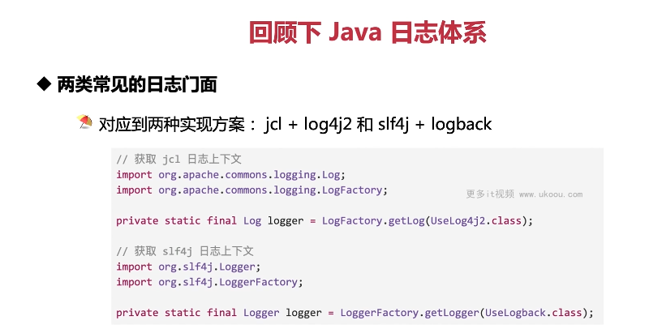
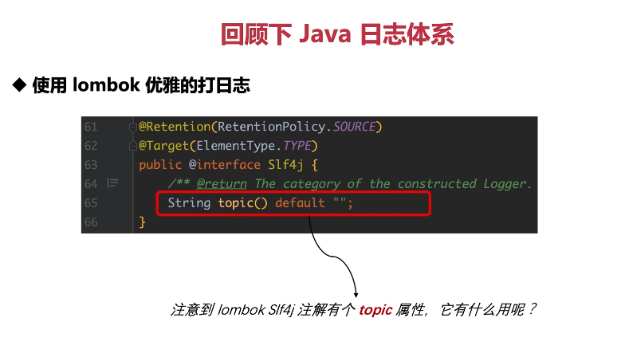

这张图片回顾了 Java 日志体系，特别是两类常见的日志门面及其对应的实现方案。

1. **两类常见的日志门面**：Java 中有两种常见的日志门面，即 JCL（Jakarta Commons Logging）和 SLF4J（Simple Logging Facade for Java）。
2. **两种实现方案**：这两种日志门面都有各自的实现方案，分别是 JCL+Log4j 和 SLF4J+Logback。

下面是获取 JCL 日志上下文和 SLF4J 日志上下文的代码示例：

```java
// 获取 JCL 日志上下文
import org.apache.commons.logging.Log;
import org.apache.commons.logging.LogFactory;

private static final Log logger = LogFactory.getLog(UseLog4j2.class);

// 获取 SLF4J 日志上下文
import org.slf4j.Logger;
import org.slf4j.LoggerFactory;

private static final Logger logger = LoggerFactory.getLogger(UseLogback.class);
```

在这两个例子中，我们分别使用了 JCL 和 SLF4J 来获取日志上下文。JCL 使用的是 Apache Commons Logging 库，而 SLF4J 则使用的是 Logback 库。

总结起来，Java 日志体系有多种不同的实现方式，每一种都有自己的特点和适用场景。在实际开发中，我们需要根据项目的需求和特性来选择合适的方法。



这张图片展示了一种使用 Lombok 优雅打日志的方法，具体是通过`@Slf4j`注解。

1. **使用 Lombok 优雅的打日志**：Lombok 提供了`@Slf4j`注解，可以帮助我们快速创建一个日志对象，无需手动编写复杂的日志代码。

以下是一个简单的例子：

```java
import org.slf4j.Logger;
import org.slf4j.LoggerFactory;
import lombok.extern.slf4j.Slf4j;

@Slf4j
public class MyClass {
    public void myMethod() {
        logger.info("This is an info message.");
    }
}
```

在这个例子中，我们使用了`@Slf4j`注解，Lombok 会在编译期为我们生成一个名为`logger`的日志对象。然后，我们就可以直接使用这个对象来打印日志。

**topic 属性的作用**：注意到 Lombok 的`@Slf4j`注解有个`topic`属性，它用于指定日志的主题。例如：

```java
@Retention(RetentionPolicy.SOURCE)
@Target(ElementType.TYPE)
public @interface Slf4j {
    String topic() default "";
}
```

这里的`topic`默认值为空字符串，可以通过设置这个属性来改变日志主题。例如：

```java
@Slf4j(topic = "MyTopic")
public class MyClass {
    ...
}
```

这样，所有的日志都会以"MyTopic"为主题。

总结起来，Lombok 的`@Slf4j`注解可以帮助我们快速创建日志对象，提高开发效率。同时，`topic`属性也可以用来定制日志主题，增强日志的可读性和可管理性。
