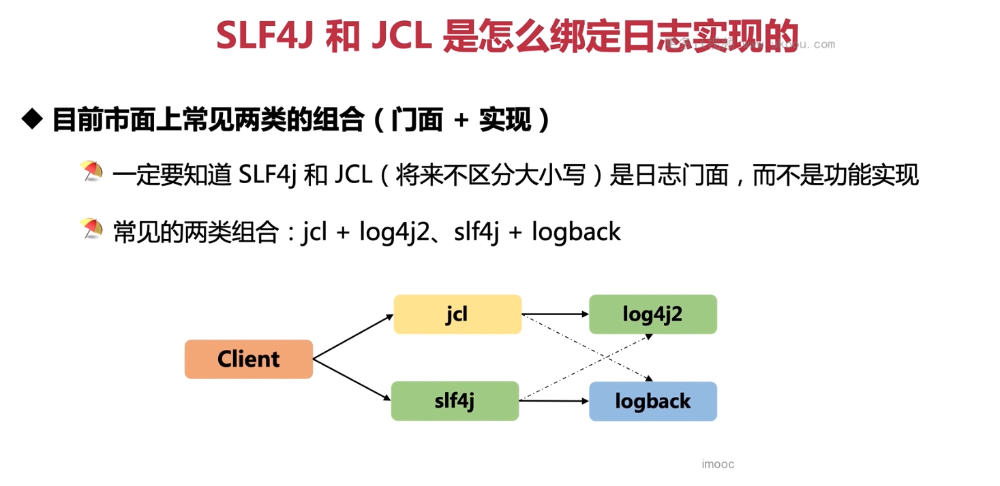
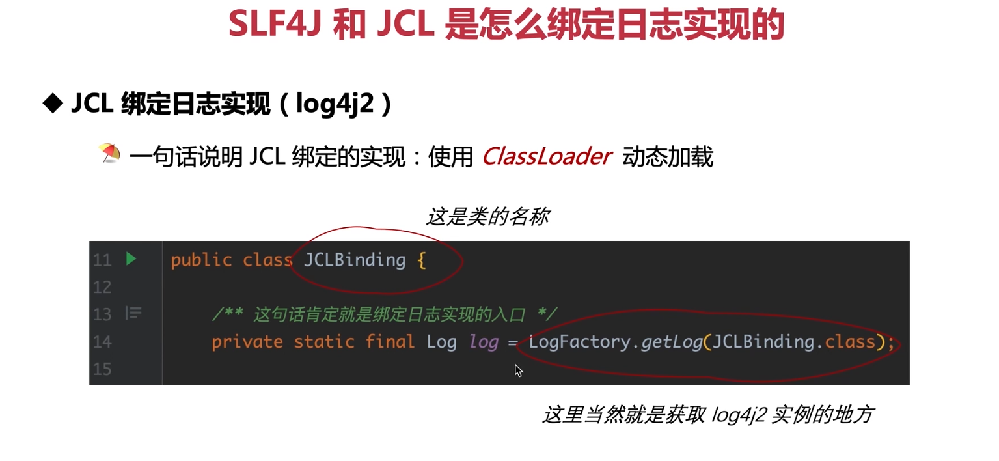
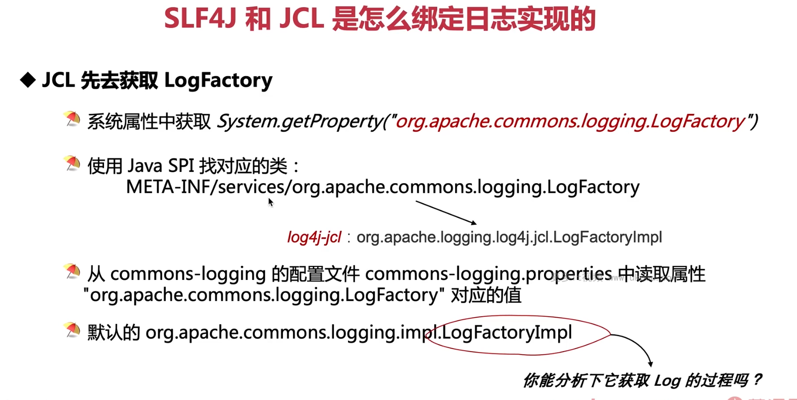

这张图片描述了 SLF4J 和 JCL 如何与日志实现进行绑定。以下是详细的说明和示例代码：

### SLF4J (Simple Logging Facade for Java)

SLF4J 是一个日志门面，它提供了一个通用的日志 API，允许应用程序在运行时绑定到不同的日志实现。SLF4J 具有良好的可移植性，可以方便地切换日志实现。以下是如何使用 SLF4J 进行日志记录的示例：

```java
import org.slf4j.Logger;
import org.slf4j.LoggerFactory;

public class Slf4jExample {
    private static final Logger logger = LoggerFactory.getLogger(Slf4jExample.class);

    public void logMessage() {
        logger.info("Hello, SLF4J!");
    }
}
```

### JCL (Jakarta Commons Logging)

JCL 是另一种日志门面，它也是为了提供一种独立于具体日志实现的方式。然而，JCL 比较老，现在推荐使用 SLF4J。以下是如何使用 JCL 进行日志记录的示例：

```java
import org.apache.commons.logging.Log;
import org.apache.commons.logging.LogFactory;

public class JclExample {
    private static final Log logger = LogFactory.getLog(JclExample.class);

    public void logMessage() {
        logger.info("Hello, JCL!");
    }
}
```

### 绑定日志实现

#### SLF4J + Logback 组合

要在 SLF4J 上绑定 Logback，你需要在项目的依赖中包含这两个库。然后，SLF4J 会自动将请求转发到 Logback 实现。以下是一个 Maven 示例：

```xml
<dependencies>
    <!-- SLF4J -->
    <dependency>
        <groupId>org.slf4j</groupId>
        <artifactId>slf4j-api</artifactId>
        <version>1.7.x</version>
    </dependency>

    <!-- Logback -->
    <dependency>
        <groupId>ch.qos.logback</groupId>
        <artifactId>logback-classic</artifactId>
        <version>1.2.x</version>
    </dependency>
</dependencies>
```

#### JCL + Log4j2 组合

要在 JCL 上绑定 Log4j2，你需要在项目的依赖中包含这两个库。然后，JCL 会自动将请求转发到 Log4j2 实现。以下是一个 Maven 示例：

```xml
<dependencies>
    <!-- JCL -->
    <dependency>
        <groupId>commons-logging</groupId>
        <artifactId>commons-logging</artifactId>
        <version>1.2</version>
    </dependency>

    <!-- Log4j2 -->
    <dependency>
        <groupId>org.apache.logging.log4j</groupId>
        <artifactId>log4j-core</artifactId>
        <version>2.x.y</version>
    </dependency>
    <dependency>
        <groupId>org.apache.logging.log4j</groupId>
        <artifactId>log4j-jcl</artifactId>
        <version>2.x.y</version>
    </dependency>
</dependencies>
```

请注意，为了使 JCL 使用 Log4j2，你需要引入 `log4j-jcl` 包，它是一个桥接器，将 JCL 请求转发到 Log4j2。

### 图片中的关系图

- Client：代表使用日志 API 的应用程序代码。
- SLF4J：表示应用程序使用的日志门面。
- Logback：表示 SLF4J 绑定的日志实现。
- JCL：表示应用程序可能存在的旧日志门面。
- Log4j2：表示 JCL 绑定的日志实现。

在实际应用中，你可能会遇到这样的情况：应用程序既使用了 SLF4J，又使用了 JCL。在这种情况下，你需要确保正确地配置了日志桥接器，以防止出现混淆。例如，在 SLF4J 和 JCL 都存在的情况下，你可能需要排除 JCL 的实现，并使用 SLF4J-to-JCL 桥接器，如下所示：

```xml
<!-- Excluding JCL implementation -->
<dependency>
    <groupId>org.slf4j</groupId>
    <artifactId>jcl-over-slf4j</artifactId>
    <version>1.7.x</version>
</dependency>

<!-- Including SLF4J-to-JCL bridge -->
<dependency>
    <groupId>org.slf4j</groupId>
    <artifactId>slf4j-jcl</artifactId>
    <version>1.7.x</version>
</dependency>
```

这样，所有的 JCL 请求都会被转发到 SLF4J，然后再由 SLF4J 转发到 Logback。

### 总结

- SLF4J 和 JCL 是日志门面，它们提供了一个统一的 API 来访问各种日志实现。
- 常见的组合包括 SLF4J + Logback 和 JCL + Log4j2。
- 为了正确地使用这些组合，你需要在项目中包含正确的依赖项，并确保正确地配置了桥接器，以避免日志冲突。



这张图片展示了一个名为 `JCLBinding` 的类，其中包含了如何使用 JCL (Jakarta Commons Logging) 绑定到 Log4j2 的示例。以下是这个过程的详细解释和代码示例：

### JCL 绑定日志实现 (Log4j2)

JCL 使用 `LogFactory.getLog()` 方法来获取日志记录器。这个方法会尝试查找可用的日志实现并返回相应的日志记录器。在本例中，我们将使用 Log4j2 作为日志实现。首先，我们需要在项目的依赖中包含 JCL 和 Log4j2：

```xml
<dependencies>
    <!-- JCL -->
    <dependency>
        <groupId>commons-logging</groupId>
        <artifactId>commons-logging</artifactId>
        <version>1.2</version>
    </dependency>

    <!-- Log4j2 -->
    <dependency>
        <groupId>org.apache.logging.log4j</groupId>
    <artifactId>log4j-core</artifactId>
    <version>2.x.y</version>
    </dependency>
    <dependency>
        <groupId>org.apache.logging.log4j</groupId>
        <artifactId>log4j-jcl</artifactId>
        <version>2.x.y</version>
    </dependency>
</dependencies>
```

接下来，创建一个名为 `JCLBinding` 的类，使用 `LogFactory.getLog()` 获取 Log4j2 实例：

```java
import org.apache.commons.logging.Log;
import org.apache.commons.logging.LogFactory;

public class JCLBinding {
    private static final Log log = LogFactory.getLog(JCLBinding.class);

    public void logMessage() {
        log.info("Hello, Log4j2 via JCL!");
    }
}
```

注意，为了使 JCL 使用 Log4j2，你需要引入 `log4j-jcl` 桥接器。这个桥接器的作用是将 JCL 请求转发到 Log4j2。同时，你也需要排除任何可能存在的其他日志实现，以免产生混淆。例如，如果你的项目中已经包含了 Logback，那么你应该排除它：

```xml
<!-- Excluding Logback -->
<dependency>
    <groupId>ch.qos.logback</groupId>
    <artifactId>logback-classic</artifactId>
    <scope>provided</scope>
</dependency>
```

### ClassLoader 动态加载

JCL 使用 `ClassLoader` 动态加载日志实现。当你调用 `LogFactory.getLog()` 时，它会检查已加载的类路径中是否存在可用的日志实现。如果没有找到合适的实现，它会继续搜索下一个可用的日志实现。在本例中，由于我们已经引入了 `log4j-jcl` 桥接器，JCL 会发现 Log4j2 并将其作为日志实现。

### 总结

- JCL 使用 `LogFactory.getLog()` 方法来获取日志记录器。
- 为了使 JCL 使用 Log4j2，你需要引入 `log4j-jcl` 桥接器并将其他可能存在的日志实现排除。
- JCL 使用 `ClassLoader` 动态加载日志实现，以确定最佳的日志实现。



这张图片描述了 JCL (Jakarta Commons Logging) 如何获取 `LogFactory` 并绑定到日志实现的过程。以下是详细的步骤和代码示例：

### JCL 获取 `LogFactory`

JCL 在获取 `LogFactory` 时遵循以下顺序：

1. **从系统属性中获取 `LogFactory`**：
   JCL 首先尝试从系统属性中获取 `LogFactory` 的实现。可以通过 `System.getProperty()` 方法指定自定义的 `LogFactory` 类：

   ```java
   String className = System.getProperty("org.apache.commons.logging.LogFactory");
   ```

2. **使用 Java SPI 找到对应的 `LogFactory`**：
   如果系统属性中没有指定 `LogFactory`，JCL 将使用 Java Service Provider Interface (SPI) 查找 `META-INF/services/org.apache.commons.logging.LogFactory` 文件。这个文件应该包含一个实现了 `LogFactory` 接口的类名。例如，对于 `log4j-jcl`，它可能是 `org.apache.logging.log4j.jcl.Log4jLogFactory`。

3. **从 `commons-logging.properties` 配置文件读取属性**：
   如果以上两个步骤都没有找到 `LogFactory`，JCL 将尝试从 `commons-logging.properties` 配置文件中读取 "org.apache.commons.logging.LogFactory" 属性。默认情况下，这个值是 `org.apache.commons.logging.impl.LogFactoryImpl`。

### 示例代码

以下是一个简单的示例，演示了如何使用 JCL 获取 `LogFactory`：

```java
import org.apache.commons.logging.Log;
import org.apache.commons.logging.LogFactory;

public class JCLExample {
    private static final Log log = LogFactory.getLog(JCLExample.class);

    public void logMessage() {
        log.info("Hello, JCL!");
    }

    public static void main(String[] args) {
        JCLExample example = new JCLExample();
        example.logMessage();
    }
}
```

### JCL 绑定日志实现

一旦获得了 `LogFactory`，JCL 就会使用它来获取 `Log` 实例。在我们的示例中，`LogFactory.getLog()` 方法将返回一个 `Log` 实例，该实例对应于所选的日志实现。要使 JCL 使用 Log4j2，你需要在项目中包含 `log4j-jcl` 桥接器，并且确保没有其他日志实现干扰。例如，如果你的项目中已经包含了 Logback，你应该排除它：

```xml
<!-- 引入 log4j-jcl 桥接器 -->
<dependency>
    <groupId>org.apache.logging.log4j</groupId>
    <artifactId>log4j-jcl</artifactId>
    <version>2.x.y</version>
</dependency>

<!-- 排除 Logback -->
<dependency>
    <groupId>ch.qos.logback</groupId>
    <artifactId>logback-classic</artifactId>
    <scope>provided</scope>
</dependency>
```

### 总结

- JCL 通过多种方式寻找 `LogFactory`，包括系统属性、Java SPI 和配置文件。
- 为了使 JCL 使用 Log4j2，你需要引入 `log4j-jcl` 桥接器，并排除其他可能存在的日志实现。
- JCL 使用 `LogFactory.getLog()` 返回一个 `Log` 实例，该实例对应于选定的日志实现。
