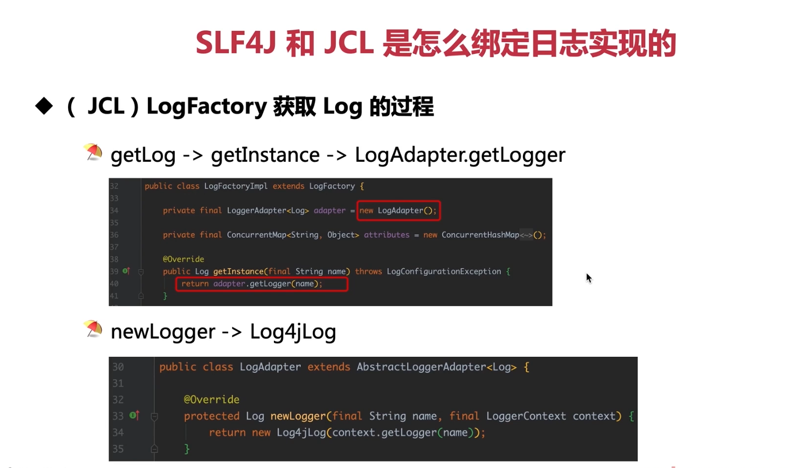
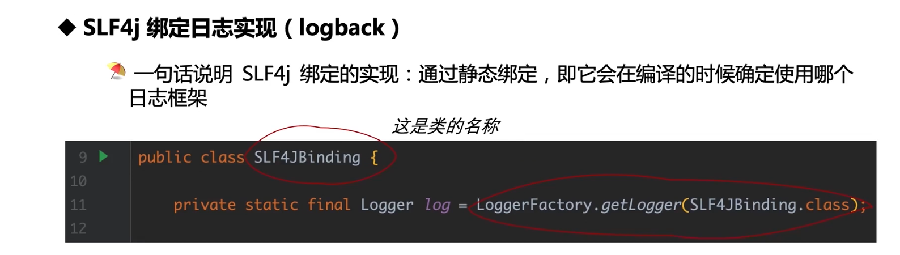
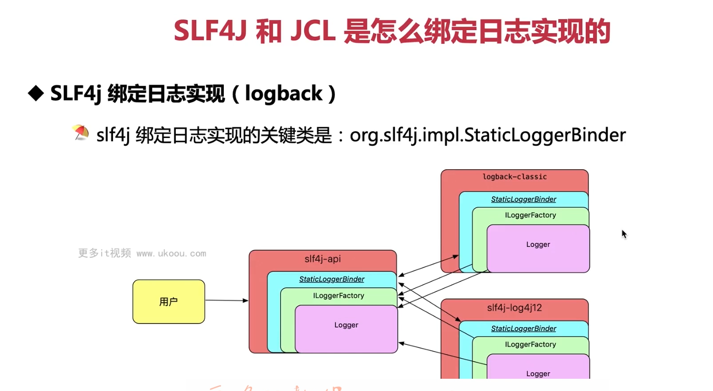

这张图片展示了 JCL 中 `LogFactory` 获取 `Log` 对象的过程。以下是详细的步骤和代码示例：

### JCL `LogFactory` 获取 `Log` 过程

1. **初始化 `LogFactory`**：JCL 使用 `LogFactoryImpl` 类作为其默认的 `LogFactory` 实现。在这个类中，有一个 `LogAdapter` 对象用于适配不同的日志框架（如 Log4j 或 Logback）。

   ```java
   public class LogFactoryImpl extends LogFactory {
       private final LogAdapter adapter = new LogAdapter();
       // ...
   }
   ```

2. **获取 `Log` 对象**：当调用 `LogFactory.getLog(name)` 方法时，`LogFactoryImpl` 会调用 `adapter.getLogger(name)` 来获取实际的日志对象。

   ```java
   @Override
   public Log getInstance(final String name) throws LogConfigurationException {
       return adapter.getLogger(name);
   }
   ```

3. **适配器创建新的日志对象**：`LogAdapter` 负责根据当前使用的日志框架创建一个新的日志对象。在本例中，`LogAdapter` 创建的是 `Log4jLog` 对象。

   ```java
   public class LogAdapter extends AbstractLoggerAdapter<Log> {
       @Override
       protected Log newLogger(String name, LoggerContext context) {
           return new Log4jLog(context.getLogger(name));
       }
   }
   ```

### 示例代码

下面是一个简单的示例，说明如何使用 JCL 获取 `Log` 对象：

```java
import org.apache.commons.logging.Log;
import org.apache.commons.logging.LogFactory;

public class JCLExample {
    private static final Log log = LogFactory.getLog(JCLExample.class);

    public void logMessage() {
        log.info("Hello, JCL!");
    }

    public static void main(String[] args) {
        JCLExample example = new JCLExample();
        example.logMessage();
    }
}
```

### JCL 绑定日志实现

为了使 JCL 使用 Log4j2，你需要引入 `log4j-jcl` 桥接器，并排除其他可能存在的日志实现。例如，如果你的项目中已经包含了 Logback，你应该排除它：

```xml
<!-- 引入 log4j-jcl 桥接器 -->
<dependency>
    <groupId>org.apache.logging.log4j</groupId>
    <artifactId>log4j-jcl</artifactId>
    <version>2.x.y</version>
</dependency>

<!-- 排除 Logback -->
<dependency>
    <groupId>ch.qos.logback</groupId>
    <artifactId>logback-classic</artifactId>
    <scope>provided</scope>
</dependency>
```

### 总结

- JCL 使用 `LogFactory` 获取 `Log` 对象。
- `LogFactory` 通过 `LogAdapter` 适配不同的日志框架。
- 为了使 JCL 使用 Log4j2，你需要引入 `log4j-jcl` 桥接器，并排除其他可能存在的日志实现。



这张图片显示了一个名为 `SLF4JBinding` 的类，其中包含了如何使用 SLF4J (Simple Logging Facade for Java) 绑定到 Logback 的示例。以下是这个过程的详细解释和代码示例：

### SLF4J 绑定日志实现 (Logback)

SLF4J 是一种日志门面，它提供了一种统一的方式来访问各种日志框架，如 Logback、Log4j 或 JDK 自带的日志。与 JCL 不同，SLF4J 使用静态绑定，这意味着它会在编译时决定使用哪个日志框架。这是通过在编译时引入适当的绑定依赖项来实现的。

#### 编译时绑定

为了使用 Logback 作为日志实现，你必须在你的项目中包含 Logback 的绑定依赖项：

```xml
<dependency>
    <groupId>ch.qos.logback</groupId>
    <artifactId>logback-classic</artifactId>
    <version>1.x.y</version>
</dependency>
```

#### 示例代码

创建一个名为 `SLF4JBinding` 的类，使用 `LoggerFactory.getLogger()` 获取 Logback 实例：

```java
import org.slf4j.Logger;
import org.slf4j.LoggerFactory;

public class SLF4JBinding {
    private static final Logger log = LoggerFactory.getLogger(SLF4JBinding.class);

    public void logMessage() {
        log.info("Hello, Logback via SLF4J!");
    }
}
```

### 总结

- SLF4J 使用静态绑定，在编译时决定使用哪个日志框架。
- 为了使 SLF4J 使用 Logback，你需要在项目中包含 Logback 的绑定依赖项。



这张图片展示了一个关于 SLF4J 如何绑定日志实现的架构图，特别是强调了 `org.slf4j.impl.StaticLoggerBinder` 类的作用。以下是详细的解释和代码示例：

### SLF4J 绑定日志实现 (Logback)

SLF4J 提供了一个简单的方法来访问底层的日志实现，如 Logback。关键在于 `StaticLoggerBinder` 类，它是 SLF4J API 的一部分，负责为用户程序提供正确的日志记录器。

#### 架构图分析

1. 用户代码通过 SLF4J API 访问日志功能。
2. SLF4J API 包含 `ILoggerFactory` 接口，它由 `StaticLoggerBinder` 类实现。
3. `StaticLoggerBinder` 类是一个静态内部类，提供了 `getLoggerFactory()` 方法，用于获取 `ILoggerFactory` 的实例。
4. `ILoggerFactory` 又用来创建 `Logger` 实例。
5. 为了使用 Logback，需要在项目中包含 `slf4j-log4j12` 依赖项，这使得 `StaticLoggerBinder` 能够指向 Logback 的实现。

#### 示例代码

创建一个名为 `SLF4JBinding` 的类，使用 `LoggerFactory.getLogger()` 获取 Logback 实例：

```java
import org.slf4j.Logger;
import org.slf4j.LoggerFactory;

public class SLF4JBinding {
    private static final Logger log = LoggerFactory.getLogger(SLF4JBinding.class);

    public void logMessage() {
        log.info("Hello, Logback via SLF4J!");
    }
}
```

### 总结

- SLF4J 通过 `StaticLoggerBinder` 类进行日志实现的绑定。
- 为了使 SLF4J 使用 Logback，你需要在项目中包含 Logback 的绑定依赖项。