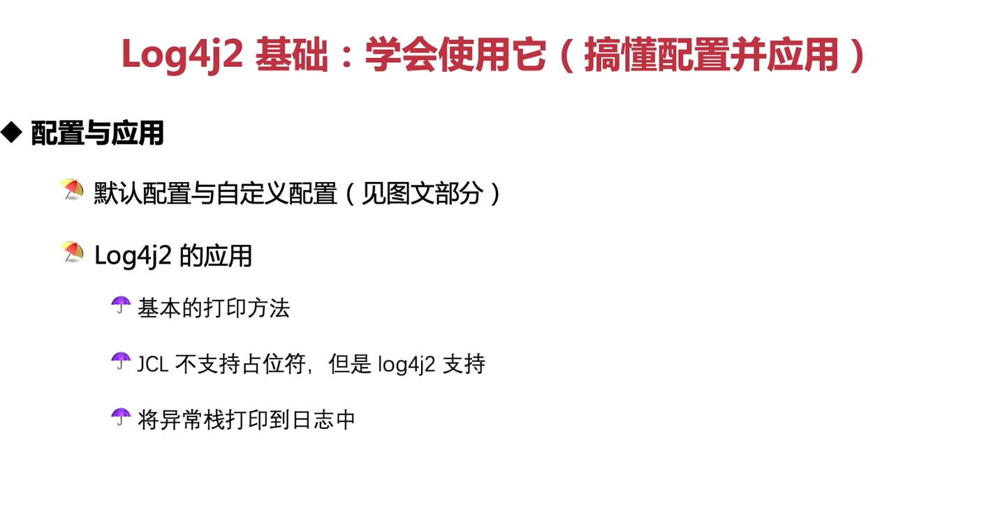

这张图片概述了 Log4j2 基础知识，包括配置和应用。以下是关于这些主题的一些详细信息和代码示例：

### 默认配置与自定义配置

Log4j2 提供了一些默认配置，但通常建议使用自定义配置以满足特定需求。你可以通过创建一个名为 `log4j2.xml` 或 `log4j2.json` 的配置文件来自定义配置。以下是一个基本的 XML 配置示例：

```xml
<?xml version="1.0" encoding="UTF-8"?>
<Configuration status="WARN">
    <Appenders>
        <Console name="Console" target="SYSTEM_OUT">
            <PatternLayout pattern="%d{HH:mm:ss.SSS} [%t] %-5level %logger{36} - %msg%n"/>
        </Console>
    </Appenders>
    <Loggers>
        <Root level="info">
            <AppenderRef ref="Console"/>
        </Loggers>
    </Loggers>
</Configuration>
```

### 应用

#### 基本的打印方法

Log4j2 支持各种级别的日志记录，包括 `TRACE`, `DEBUG`, `INFO`, `WARN`, `ERROR`, 和 `FATAL` 等。以下是一些基本的打印方法示例：

```java
import org.apache.logging.log4j.LogManager;
import org.apache.logging.log4j.Logger;

public class Log4j2Example {
    private static final Logger logger = LogManager.getLogger(Log4j2Example.class);

    public void logMessages() {
        logger.trace("This is a trace message.");
        logger.debug("This is a debug message.");
        logger.info("This is an info message.");
        logger.warn("This is a warning message.");
        logger.error("This is an error message.");
    }
}
```

#### 占位符支持

Log4j2 支持占位符，可以方便地插入变量。以下是如何使用占位符的例子：

```java
public void logWithPlaceholders(int value, String text) {
    logger.info("Value is {} and the text is {}", value, text);
}
```

#### 异常栈跟踪

Log4j2 允许你轻松地将异常堆栈跟踪信息添加到日志中：

```java
try {
    throw new Exception("An exception occurred.");
} catch (Exception e) {
    logger.error("Error occurred.", e);
}
```

### 总结

- Log4j2 提供了默认配置，但推荐使用自定义配置。
- 使用 `LogManager.getLogger()` 获取日志记录器并使用不同级别记录消息。
- Log4j2 支持占位符和异常堆栈跟踪。