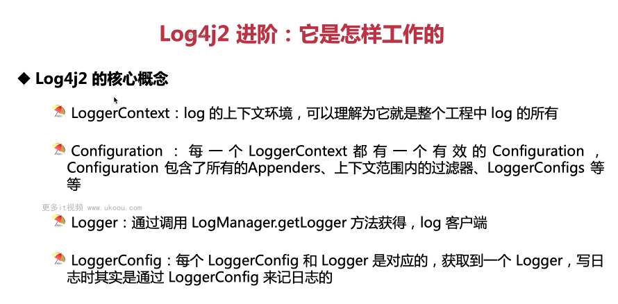
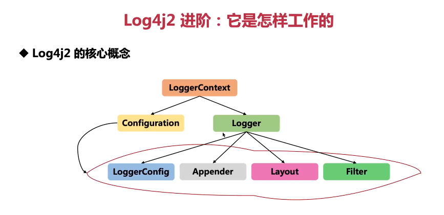

这张图片介绍的是 Log4j2 的核心概念，这是一个流行的 Java 日志框架。让我们逐一了解这些核心概念及其作用：

1. **LoggerContext**: 这是 log 的上下文环境，可以理解为整个工程中的所有日志记录器（logger）的容器。它是 Log4j2 运行时环境的基础，负责管理所有的日志配置和实例。

2. **Configuration**: 每个 LoggerContext 都有一个有效的 Configuration，它包含了所有的 Appenders（输出目的地）、过滤器、LoggerConfigs 等。这个配置定义了日志应该如何被记录、格式化和发送到指定的目的地。

3. **Logger**: Logger 是通过调用 LogManager.getLogger 方法获得的，它是日志客户端，也就是我们通常在代码中使用的对象。当我们需要记录日志时，我们会创建一个 Logger 实例。

4. **LoggerConfig**: 每个 LoggerConfig 对应一个 Logger，当获取到一个 Logger 后，实际上是通过 LoggerConfig 来进行实际的日志记录工作的。

下面是一个简单的示例，展示了如何在 Java 代码中使用 Log4j2 记录日志：

```java
import org.apache.logging.log4j.LogManager;
import org.apache.logging.log4j.Logger;

public class LogExample {
    private static final Logger logger = LogManager.getLogger(LogExample.class);

    public static void main(String[] args) {
        logger.info("This is an info message.");
        logger.debug("Debugging information.");
        logger.error("An error occurred.", new Exception("Exception for demonstration purposes."));
    }
}
```

在这个例子中，我们首先导入了 LogManager 和 Logger 类。然后，我们在 main 方法之外定义了一个静态的 Logger 实例，通过传递当前类的 Class 对象给 LogManager.getLogger 方法。这样做的好处是我们可以在不关心具体实现的情况下，直接使用类名作为日志源。

在 main 方法中，我们分别记录了 info 级别的消息、debug 级别的消息和 error 级别的消息，同时还附带了一个异常。这些日志级别可以帮助我们区分不同严重程度的消息。

注意，为了使上述代码工作，你需要在项目中引入 Log4j2 的依赖，并配置一个合适的配置文件（如 log4j2.xml 或 log4j2.properties）。以下是一个简单的 XML 配置文件示例：

```xml
<?xml version="1.0" encoding="UTF-8"?>
<Configuration status="WARN">
    <Appenders>
        <Console name="Console" target="SYSTEM_OUT">
            <PatternLayout pattern="%d{HH:mm:ss.SSS} [%t] %-5level %logger{36} - %msg%n"/>
        </Console>
    </Appenders>
    <Loggers>
        <Root level="info">
            <AppenderRef ref="Console"/>
        </Root>
    </Loggers>
</Configuration>
```

这个配置文件指定了一个名为 Console 的 appender，它将日志打印到标准输出，并使用一个简单的模式布局。根 logger 设置为 info 级别，这意味着它将接收并转发所有 info 及以上的日志事件到 Console appender。

总结来说，Log4j2 提供了强大的日志功能，帮助开发者记录应用程序的运行状态和错误信息。通过合理的配置和使用，我们可以更好地监控和调试我们的 Java 应用。



这张图片展示的是 Log4j2 的核心概念之间的关系。让我们详细了解一下这些概念：

1. **LoggerContext**: 这是 Log4j2 的全局上下文，它管理着所有的日志记录器（logger），并且持有当前有效的配置。

2. **Configuration**: 配置定义了日志记录的行为，包括日志记录器的配置、过滤器、布局和附加器。它可以是 XML、JSON 或 YAML 格式的文件，也可以是动态的配置。

3. **Logger**: 日志记录器是实际用来记录日志的对象。它们可以通过`org.apache.logging.log4j.LogManager`获取，通常按照包名或类名命名。

4. **LoggerConfig**: 这是配置的一部分，它定义了特定日志记录器的行为，包括其父级、级别、过滤器和附加器。

5. **Appender**: Appender 负责将日志写入目标，如控制台、文件、数据库或其他系统。每个 Appender 都关联了一个布局和可能的过滤器。

6. **Layout**: 布局定义了日志消息的格式。Log4j2 支持多种布局，如 PatternLayout、JSONLayout 等。

7. **Filter**: 过滤器决定了哪些日志消息会被记录。可以根据日志级别、日志记录器名称或其他条件进行过滤。

以下是一个简单的 Log4j2 配置文件的例子（log4j2.xml）：

```xml
<Configuration status="WARN">
    <Appenders>
        <Console name="Console" target="SYSTEM_OUT">
            <PatternLayout pattern="%d{HH:mm:ss.SSS} [%t] %-5level %logger{36} - %msg%n"/>
        </Console>
    </Appenders>
    <Loggers>
        <Root level="info">
            <AppenderRef ref="Console"/>
        </Root>
    </Loggers>
</Configuration>
```

在这个配置中，我们定义了一个名为 Console 的 Appender，它将日志输出到控制台，并使用一个简单的模式布局。根日志记录器设置为 info 级别，意味着它将接收并转发所有 info 及以上的日志事件到 Console appender。

现在，让我们看一个使用 Log4j2 记录日志的 Java 代码示例：

```java
import org.apache.logging.log4j.LogManager;
import org.apache.logging.log4j.Logger;

public class LogExample {
    private static final Logger logger = LogManager.getLogger(LogExample.class);

    public static void main(String[] args) {
        logger.trace("This is a trace message.");
        logger.debug("Debugging information.");
        logger.info("Normal informational message.");
        logger.warn("A warning has occurred.");
        logger.error("An error happened.", new RuntimeException());
    }
}
```

在这个例子中，我们首先导入了 LogManager 和 Logger 类。然后，在 main 方法外定义了一个静态的 Logger 实例，通过传递当前类的 Class 对象给 LogManager.getLogger 方法。这样做的好处是我们可以在不关心具体实现的情况下，直接使用类名作为日志源。

在 main 方法中，我们分别记录了 trace、debug、info、warn 和 error 级别的消息，同时还附带了一个异常。这些日志级别可以帮助我们区分不同严重程度的消息。

注意，为了使上述代码工作，你需要在项目中引入 Log4j2 的依赖，并配置一个合适的配置文件（如 log4j2.xml 或 log4j2.properties）。如果没有配置文件，Log4j2 会使用默认的配置，这可能不符合你的需求。

总结起来，Log4j2 提供了一种灵活的方式来管理和记录日志。通过合理的配置和使用，我们可以更好地监控和调试我们的 Java 应用。
