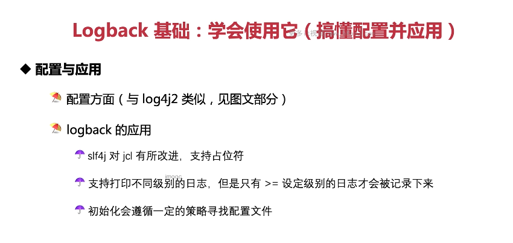

这张图片讨论了Logback的基本概念，特别是它的配置和应用方面。让我们逐点解释：

1. **配置方面**：Logback的配置类似于Log4j2，但有自己的语法和特性。配置文件通常以`.xml`结尾，如`logback.xml`或`logback-test.xml`。配置文件定义了日志的输出位置、格式以及过滤规则等。

2. **slf4j 对 jcl 有所改进，支持占位符**：SLF4J（Simple Logging Facade for Java）是一个抽象层，允许用户自由选择底层日志框架。它为不同的日志库（如Logback、Log4j等）提供统一的API。此外，SLF4J还支持参数化的日志记录，使得日志消息更容易阅读和分析。

3. **支持打印不同级别的日志，但是只有 >= 设定级别的日志才会被记录下来**：Logback支持多个日志级别，如TRACE、DEBUG、INFO、WARN和ERROR。你可以根据需要设置某个日志记录器的级别，低于此级别的日志将被忽略。

4. **初始化会遵循一定的策略寻找配置文件**：Logback会在启动时自动加载配置文件。它会尝试从几个预定义的位置加载配置文件，包括`classpath:`前缀表示的类路径、`file:`前缀表示的文件系统路径等。

以下是一个简单的Logback配置文件（logback.xml）的例子：

```xml
<configuration>
    <appender name="STDOUT" class="ch.qos.logback.core.ConsoleAppender">
        <!-- encoders are assigned the type ch.qos.logback.classic.encoder.PatternLayoutEncoder by default -->
        <encoder>
            <pattern>%d{HH:mm:ss.SSS} [%thread] %-5level %logger{36} - %msg%n</pattern>
        </encoder>
    </appender>

    <root level="info">
        <appender-ref ref="STDOUT" />
    </root>
</configuration>
```

在这个配置中，我们定义了一个名为STDOUT的Appender，它将日志输出到控制台，并使用一个简单的模式布局。根日志记录器设置为info级别，意味着它将接收并转发所有info及以上的日志事件到Console appender。

现在，让我们看一个使用SLF4J和Logback记录日志的Java代码示例：

```java
import org.slf4j.Logger;
import org.slf4j.LoggerFactory;

public class LogExample {
    private static final Logger logger = LoggerFactory.getLogger(LogExample.class);

    public static void main(String[] args) {
        logger.trace("This is a trace message.");
        logger.debug("Debugging information.");
        logger.info("Normal informational message.");
        logger.warn("A warning has occurred.");
        logger.error("An error happened.", new RuntimeException());
    }
}
```

在这个例子中，我们首先导入了LoggerFactory和Logger类。然后，在main方法外定义了一个静态的Logger实例，通过传递当前类的Class对象给LoggerFactory.getLogger方法。这样做的好处是我们可以在不关心具体实现的情况下，直接使用类名作为日志源。

在main方法中，我们分别记录了trace、debug、info、warn和error级别的消息，同时还附带了一个异常。这些日志级别可以帮助我们区分不同严重程度的消息。

注意，为了使上述代码工作，你需要在项目中引入SLF4J和Logback的依赖，并配置一个合适的配置文件（如logback.xml或logback-test.xml）。如果没有配置文件，Logback会使用默认的配置，这可能不符合你的需求。

总结起来，Logback提供了一种灵活的方式来管理和记录日志。通过合理的配置和使用，我们可以更好地监控和调试我们的Java应用。