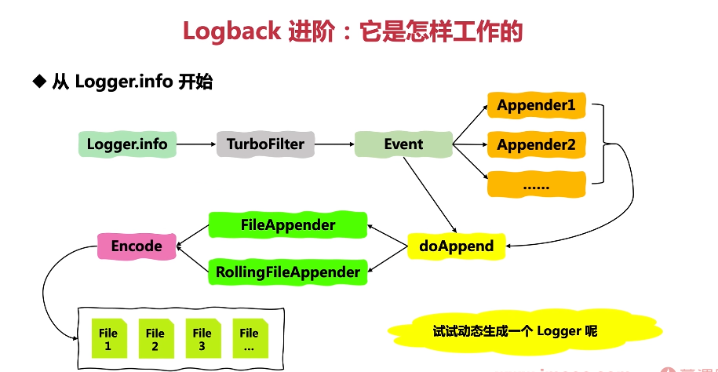

这张图片描述了 Logback 的工作原理，尤其是从`Logger.info`开始的过程。让我们逐步解析这个过程：

1. **Logger.info**：当你调用`Logger.info()`方法时，实际上是在向日志系统发送一条日志事件。
2. **TurboFilter**：这是 Logback 的一个特殊过滤器，用于加速日志处理。它可以在日志事件到达其他过滤器之前快速决定是否丢弃该事件，从而提高性能。
3. **Event**：日志事件包含日志消息的所有相关信息，如日志级别、时间戳、线程名等。
4. **Appender1, Appender2...**：这些是日志事件的目标，可以是控制台、文件、数据库等。每个 Appender 都会有一个编码器（Encoder）来格式化日志消息。
5. **doAppend**：这是 Appender 处理日志事件的主要方法。
6. **FileAppender 和 RollingFileAppender**：这两个是特殊的 Appender，用于将日志写入文件。RollingFileAppender 还可以滚动日志文件，例如按日期或者大小滚动。
7. **Encode**：编码器将日志事件转换成字节流，以便写入文件或其他输出设备。
8. **File 1, File 2, ...**：这是日志文件的实际存储位置。

以下是一个使用 Logback 记录日志的 Java 代码示例：

```java
import org.slf4j.Logger;
import org.slf4j.LoggerFactory;

public class LogExample {
    private static final Logger logger = LoggerFactory.getLogger(LogExample.class);

    public static void main(String[] args) {
        logger.info("This is an info message.");
        logger.debug("Debugging information.");
        logger.error("An error occurred.", new Exception("Exception for demonstration purposes."));
    }
}
```

在这个例子中，我们首先导入了 LoggerFactory 和 Logger 类。然后，在 main 方法外定义了一个静态的 Logger 实例，通过传递当前类的 Class 对象给 LoggerFactory.getLogger 方法。这样做的好处是我们可以在不关心具体实现的情况下，直接使用类名作为日志源。

在 main 方法中，我们分别记录了 info、debug 和 error 级别的消息，同时还附带了一个异常。这些日志级别可以帮助我们区分不同严重程度的消息。

注意，为了使上述代码工作，你需要在项目中引入 SLF4J 和 Logback 的依赖，并配置一个合适的配置文件（如 logback.xml 或 logback-test.xml）。如果没有配置文件，Logback 会使用默认的配置，这可能不符合你的需求。

总结起来，Logback 提供了一种灵活的方式来管理和记录日志。通过合理的配置和使用，我们可以更好地监控和调试我们的 Java 应用。
