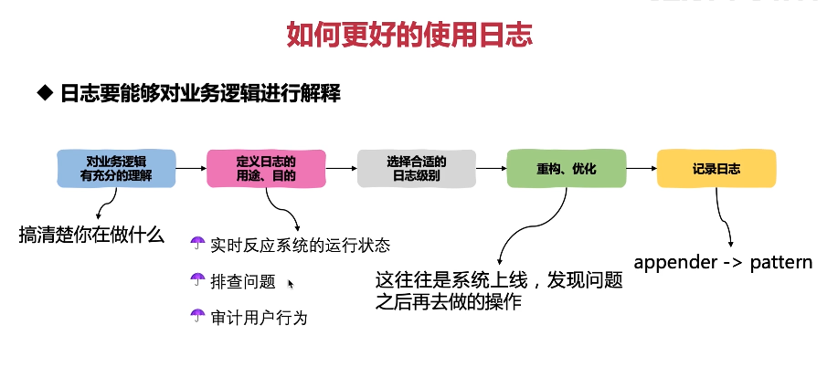
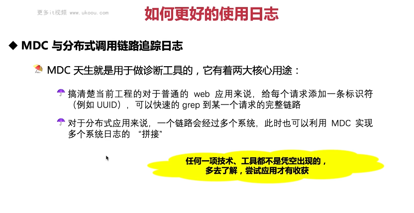

这张图片讲述了如何更好的使用日志。

1. **好的日志应该是怎样的**：有着合适的日志文件命名、滚动方式；在不同的场景下选择了合适的日子级别；选择好日志打印的实质，让你的日志有意义且不冗余；可读性高的日志内容与格式。
2. **规范并不是约束，更多的是建议**：代码需要打磨，日志一样需要打磨。

以下是一个简单的日志使用示例：

```java
import org.slf4j.Logger;
import org.slf4j.LoggerFactory;

public class MyLogger {
    private static final Logger logger = LoggerFactory.getLogger(MyLogger.class);

    public void logSomething() {
        logger.debug("Debug message"); // Debug级别的日志
        logger.info("Info message"); // Info级别的日志
        logger.warn("Warning message"); // Warn级别的日志
        logger.error("Error message"); // Error级别的日志
    }
}
```

在这个例子中，我们根据不同的场景选择了合适的日子级别。

总结起来，良好的日志记录能够帮助我们更好地理解程序的运行情况，提高开发效率。在实际应用中，要尽可能做到有意义但不冗余的日志记录。




这张图片讲述了如何更好的使用日志。

1. **日志要能够对业务逻辑进行解释**：首先要对业务逻辑有充分的理解，定义日志的用途和目的，选择合适的日志级别，重构优化，最后才是记录日志。
2. **实时反应系统的运行状态**：日志可以帮助我们了解程序的运行情况。
3. **排查问题**：日志是发现问题的重要手段。
4. **审计用户行为**：日志也可以用来审计用户的行为。

以下是一个简单的日志使用示例：

```java
import org.slf4j.Logger;
import org.slf4j.LoggerFactory;

public class MyLogger {
    private static final Logger logger = LoggerFactory.getLogger(MyLogger.class);

    public void logSomething() {
        logger.info("Doing something..."); // 记录日志
    }
}
```

在这个例子中，我们简单地记录了一个日志消息。

总结起来，良好的日志记录能够帮助我们更好地理解程序的运行情况，提高开发效率。在实际应用中，要尽可能做到有意义但不冗余的日志记录。




这张图片讲述了如何更好的使用日志中的MDC。

1. **MDC天生就是用于做诊断工具**：它可以用来给每个请求添加一条标识符（例如UUID），快速的grep到某一个请求的完整链路。
2. **对于分布式应用来说**：一个链路会经过多个系统，此时也可以利用MDC实现多个系统日志的“拼接”。

以下是一个简单的MDC使用示例：

```java
import ch.qos.logback.classic.MDC;
import org.slf4j.Logger;
import org.slf4j.LoggerFactory;

public class MyLogger {
    private static final Logger logger = LoggerFactory.getLogger(MyLogger.class);

    public void logWithMdc(String requestId) {
        MDC.put("requestId", requestId); // 设置请求ID

        logger.info("User request received"); // 用户请求接收
        logger.info("Course service called"); // 调用课程服务
        logger.info("Order service called"); // 调用订单服务
        logger.info("Points service called"); // 调用积分服务
        logger.info("User service called"); // 调用用户服务

        MDC.clear(); // 清理MDC
    }
}
```

在这个例子中，我们使用MDC来添加请求ID到日志中，从而实现日志的链路追踪。

总结起来，MDC是一种强大的工具，可以帮助我们更好地理解程序的运行情况。在实际应用中，可以利用MDC来添加额外的信息到日志中，提高日志的可用性。