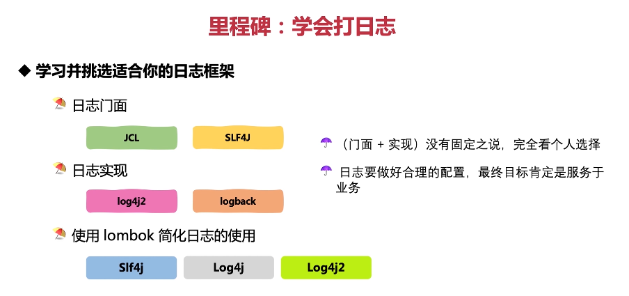
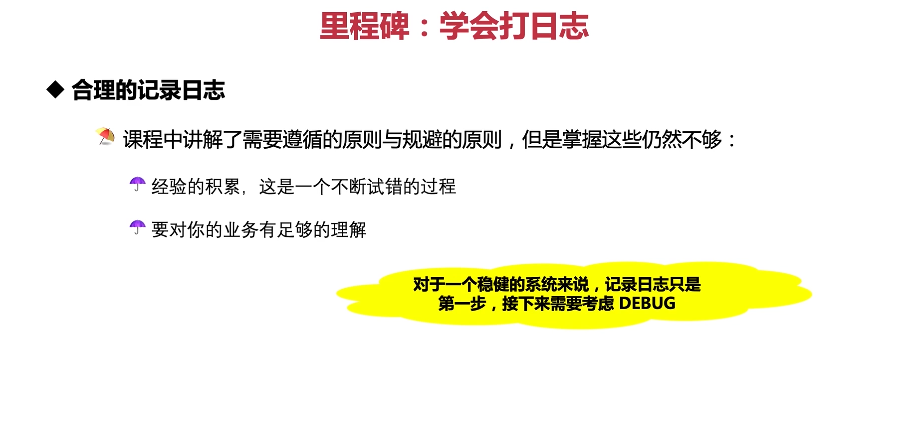

这张图片讲述了如何学会打日志。

1. **学习并挑选适合你的日志框架**：日志门面包括 JCL 和 SLF4J，日志实现包括 log4j2 和 logback，使用 lombok 简化日志的使用。
2. **没有固定之说，完全看个人选择**：日志要做好合理的配置，最终目标肯定是服务于业务。

以下是一个简单的日志使用示例：

```java
import org.slf4j.Logger;
import org.slf4j.LoggerFactory;

public class MyLogger {
    private static final Logger logger = LoggerFactory.getLogger(MyLogger.class);

    public void logSomething() {
        logger.info("Doing something..."); // 记录日志
    }
}
```

在这个例子中，我们使用了 SLF4J 作为日志门面，logback 作为日志实现。

总结起来，选择适合自己的日志框架是非常重要的，这将影响到日志的使用体验和性能。在实际应用中，可以根据需求选择合适的日志框架。



这张图片讲述了如何学会打日志。

1. **合理的记录日志**：课程中讲解了需要遵循的原则与规避的原则，但是掌握这些仍然不够，还需要经验的积累和对业务有足够的理解。
2. **对于一个稳健的系统来说**：记录日志只是第一步，接下来需要考虑 DEBUG。

以下是一个简单的日志使用示例：

```java
import org.slf4j.Logger;
import org.slf4j.LoggerFactory;

public class MyLogger {
    private static final Logger logger = LoggerFactory.getLogger(MyLogger.class);

    public void logSomething() {
        logger.info("Doing something..."); // 记录日志
    }
}
```

在这个例子中，我们使用了 SLF4J 作为日志门面，logback 作为日志实现。

总结起来，合理的记录日志是非常重要的，它可以帮助我们更好地理解程序的运行情况。在实际应用中，可以根据需求选择合适的日志框架，并合理地记录日志。
