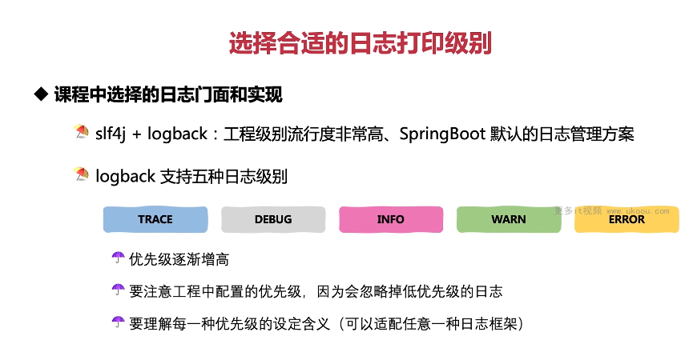

这张图片介绍了如何选择合适的日志打印级别以及课程中选择的日志门面和实现。

1. **选择的日志门面和实现**：课程中选择了 SLF4J+Logback 作为日志管理方案，这是工程级别的流行度非常高的解决方案，也是 SpringBoot 默认的日志管理方案。
2. **Logback 支持的日志级别**：Logback 支持五种日志级别，包括 TRACE、DEBUG、INFO、WARN 和 ERROR。优先级从低到高依次是 TRACE、DEBUG、INFO、WARN 和 ERROR。
3. **注意工程中的配置优先级**：在实际应用中，要注意工程中配置的日志优先级，因为会忽略掉低于当前优先级的日志。
4. **理解每种优先级的设定含义**：要理解每种优先级的设定含义，以便于适配任意一种日志框架。

以下是使用 SLF4J+Logback 打印不同级别日志的代码示例：

```java
import org.slf4j.Logger;
import org.slf4j.LoggerFactory;

public class MyLogger {
    private static final Logger logger = LoggerFactory.getLogger(MyLogger.class);

    public void logTrace() {
        logger.trace("This is a trace message.");
    }

    public void logDebug() {
        logger.debug("This is a debug message.");
    }

    public void logInfo() {
        logger.info("This is an info message.");
    }

    public void logWarn() {
        logger.warn("This is a warn message.");
    }

    public void logError() {
        logger.error("This is an error message.");
    }
}
```

在这个例子中，我们定义了一个`MyLogger`类，其中包含五个方法，分别用于打印不同级别的日志。当我们设置了日志优先级为 INFO 时，只有 INFO、WARN 和 ERROR 级别的日志会被打印出来，而 TRACE 和 DEBUG 级别的日志会被忽略。

总结起来，在选择日志级别时，要考虑实际需求和性能影响。通常情况下，生产环境应该只保留 INFO、WARN 和 ERROR 级别的日志，而开发环境中可以开启更多的日志级别，便于调试。
