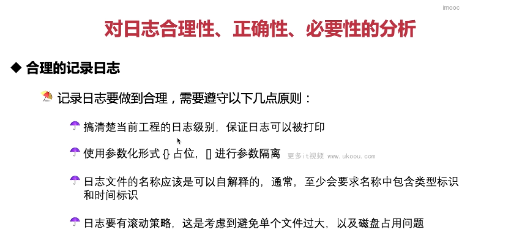
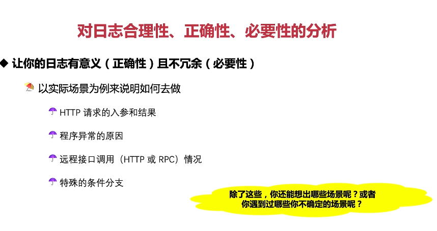

这张图片讲述了对日志合理性、正确性和必要性的分析，以及合理的记录日志的原则。

1. **合理的记录日志**：要做到合理记录日志，需要遵守以下几个原则：
   - 搞清楚当前工程的日志级别，保证日志可以被打印；
   - 使用参数化形式`{}`占位符进行参数隔离；
   - 日志文件的名称应该是可以自解释的，至少要求名称中包含类型标识和时间标识；
   - 日志要有滚动策略，避免单个文件过大，考虑磁盘占用问题。

以下是一个合理的日志记录示例：

```java
import org.slf4j.Logger;
import org.slf4j.LoggerFactory;

public class MyLogger {
    private static final Logger logger = LoggerFactory.getLogger(MyLogger.class);

    public void logMessage(String message, Object... params) {
        // 使用参数化形式占位符进行参数隔离
        logger.info(message, params);
    }
}
```

在这个例子中，我们定义了一个`logMessage`方法，接受一个格式化的消息和可变长参数列表。这样，我们可以灵活地控制日志的内容和格式。

总结起来，合理的日志记录能够帮助我们更好地理解和定位问题，提高开发效率。在实际应用中，要遵循上述原则，确保日志的有效性和可用性。



这张图片强调了日志的正确性和必要性，并给出了几个实际应用场景。

1. **有意义的日志**：日志应该具有意义，能够反映程序的状态和运行情况。
2. **不冗余的日志**：日志不应该过多，以免干扰正常的开发工作。

以下是几个实际的应用场景：

- **HTTP 请求的参与结果**：对于每个 HTTP 请求，都应该记录下请求的 URL、参数、响应状态等信息，方便后续排查问题。
- **程序异常的原因**：当程序出现异常时，应该记录下异常堆栈信息，以便于定位问题。
- **远程接口调用（HTTP 或 RPC）情况**：对于远程接口调用，应该记录下调用的 URL、参数、返回结果等信息，以便于跟踪接口调用的情况。
- **特殊的条件分支**：对于一些特殊的情况，比如循环、条件判断等，也应该记录下相关信息。

以下是一个简单的日志记录示例：

```java
import org.slf4j.Logger;
import org.slf4j.LoggerFactory;

public class MyLogger {
    private static final Logger logger = LoggerFactory.getLogger(MyLogger.class);

    public void logHttpRequest(HttpRequest request, HttpResponse response) {
        logger.info("HTTP Request: {}", request);
        logger.info("HTTP Response: {}", response);
    }

    public void logException(Exception e) {
        logger.error("An exception occurred.", e);
    }

    public void logRemoteCall(String url, String result) {
        logger.info("Remote call to {} returned {}", url, result);
    }

    public void logSpecialCase(Object obj) {
        if (obj != null) {
            logger.info("Special case: {}", obj);
        } else {
            logger.info("No special case");
        }
    }
}
```

在这个例子中，我们定义了一些方法来记录各种场景下的日志。这样，我们可以在出现问题时快速找到原因。

总结起来，正确的日志记录能够帮助我们更好地理解程序的运行情况，提高开发效率。在实际应用中，要尽可能做到有意义但不冗余的日志记录。
