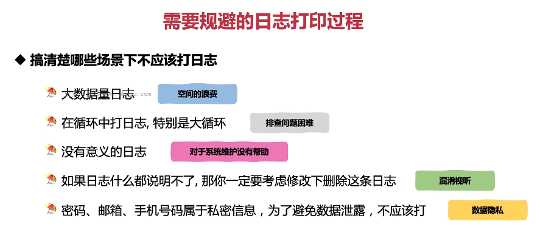

这张图片列举了几种需要规避的日志打印过程。

1. **大数据量日志**：大数据量的日志会导致空间浪费，而且可能会影响系统的性能。
2. **在循环中打日志，特别是在大循环中**：这种做法不仅浪费资源，还可能导致排错困难。
3. **没有意义的日志**：如果日志内容没有意义，那么对于系统维护没有任何帮助，反而会造成混淆视听。
4. **密码、邮箱、手机号码属于私密信息**：为了避免数据泄露，不应该将这些信息打印到日志中。

以下是一些需要规避的日志打印示例：

```java
import org.slf4j.Logger;
import org.slf4j.LoggerFactory;

public class MyLogger {
    private static final Logger logger = LoggerFactory.getLogger(MyLogger.class);

    public void logLargeData(List<String> data) {
        // 不要在循环中打印大量的数据
        for (String item : data) {
            logger.info(item);
        }
    }

    public void logPassword(String password) {
        // 不要打印敏感信息
        logger.info("Password: {}", password);
    }

    public void logMeaningless(String meaningless) {
        // 如果日志没有意义，不要打印
        logger.info(meaningless);
    }
}
```

在这个例子中，我们展示了三种需要规避的日志打印情况。在实际应用中，我们应该尽量避免这些情况，以提高系统的稳定性和安全性。

总结起来，合理的日志记录能够帮助我们更好地理解程序的运行情况，提高开发效率。在实际应用中，要尽可能做到有意义但不冗余的日志记录，同时也要注意保护用户隐私。
