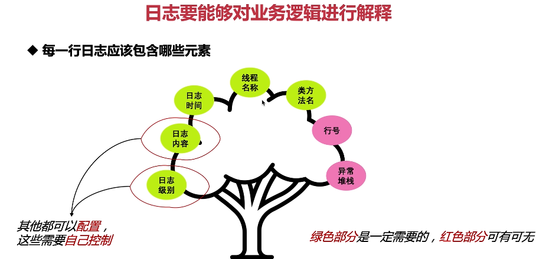

这张图片描述了每一行日志应该包含哪些元素。

1. **日志时间**：日志的时间戳是非常重要的，它可以帮助我们了解日志发生的具体时刻。
2. **日志内容**：日志的内容应该清晰明了，能够反映程序的状态和运行情况。
3. **日志级别**：日志级别可以帮助我们区分重要程度，便于过滤和查找。
4. **线程名**：线程名可以帮助我们了解日志是在哪个线程中产生的。
5. **方法名**：方法名可以帮助我们了解日志是在哪个方法中产生的。
6. **行号**：行号可以帮助我们精确定位问题所在。
7. **异常堆栈**：异常堆栈可以帮助我们了解错误发生的详细情况。

以下是一个简单的日志记录示例：

```java
import org.slf4j.Logger;
import org.slf4j.LoggerFactory;

public class MyLogger {
    private static final Logger logger = LoggerFactory.getLogger(MyLogger.class);

    public void logSomething(int i) throws Exception {
        try {
            // 记录日志
            logger.info("[{}][{}] Doing something with {}", Thread.currentThread().getName(), i);
            throw new Exception("An exception occurred.");
        } catch (Exception e) {
            // 记录异常堆栈
            logger.error("An exception occurred.", e);
        }
    }
}
```

在这个例子中，我们记录了日志时间和线程名，同时也抛出了一个异常并记录了异常堆栈。

总结起来，合理的日志记录能够帮助我们更好地理解程序的运行情况，提高开发效率。在实际应用中，要尽可能做到有意义但不冗余的日志记录。
