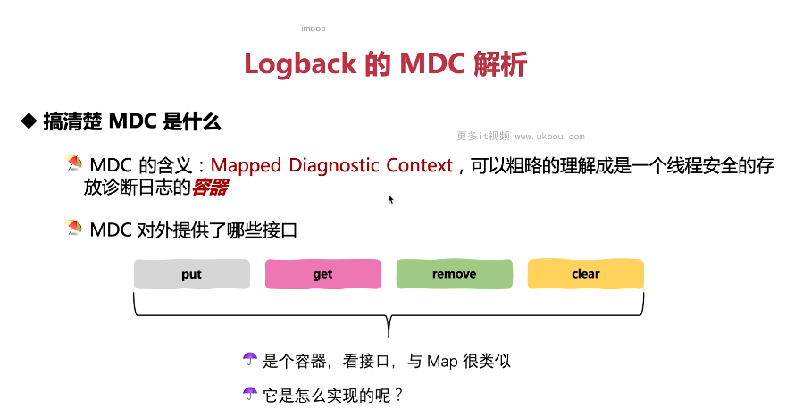
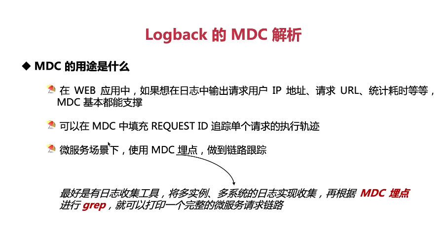

这张图片介绍了Logback的MDC解析。

1. **搞清楚MDC是什么**：MDC全称Mapped Diagnostic Context，可以粗略的理解成是一个线程安全的存放诊断日志的容器。
2. **MDC对外提供的接口**：MDC提供了一系列接口，包括put、get、remove和clear，类似于Map的操作。

以下是一个简单的MDC使用示例：

```java
import ch.qos.logback.classic.MDC;
import org.slf4j.Logger;
import org.slf4j.LoggerFactory;

public class MyLogger {
    private static final Logger logger = LoggerFactory.getLogger(MyLogger.class);

    public void logWithMdc(String key, String value) {
        MDC.put(key, value); // 设置MDC
        logger.info("This is a log message."); // 打印日志
        MDC.remove(key); // 移除MDC
    }
}
```

在这个例子中，我们使用MDC来添加额外的信息到日志中。这样，我们可以在日志中看到这些信息，有助于追踪问题。

总结起来，MDC是一种强大的工具，可以帮助我们更好地理解程序的运行情况。在实际应用中，可以利用MDC来添加额外的信息到日志中，提高日志的可用性。

