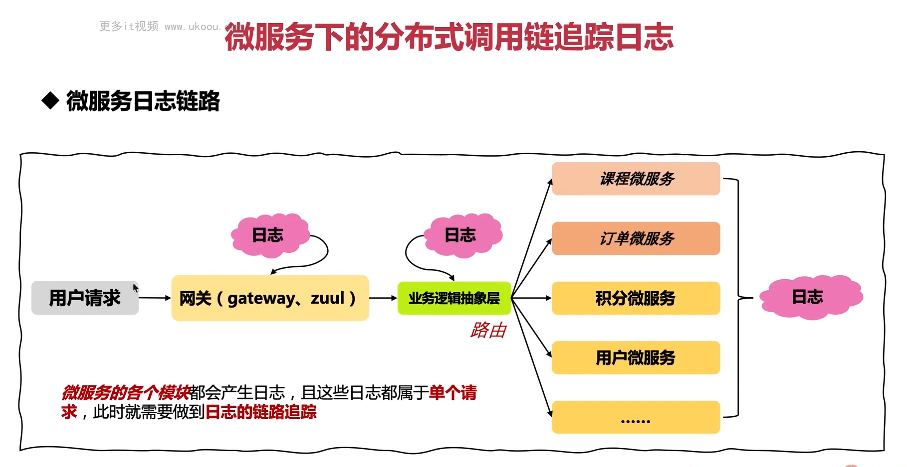

这张图片描绘了微服务下的分布式调用链追踪日志。

1. **微服务日志链路**：用户请求首先到达网关(gateway、zuul)，然后经过业务逻辑抽象层，再分别调用课程微服务、订单微服务、积分微服务和用户微服务等多个模块。每个模块都会产生日志，而这些日志都属于同一个请求，因此需要做日志的链路追踪。

以下是一个简单的日志链路追踪示例：

```java
import ch.qos.logback.classic.MDC;
import org.slf4j.Logger;
import org.slf4j.LoggerFactory;

public class MyLogger {
    private static final Logger logger = LoggerFactory.getLogger(MyLogger.class);

    public void logChain(String requestId) {
        MDC.put("requestId", requestId); // 设置请求ID

        logger.info("User request received"); // 用户请求接收
        logger.info("Course service called"); // 调用课程服务
        logger.info("Order service called"); // 调用订单服务
        logger.info("Points service called"); // 调用积分服务
        logger.info("User service called"); // 调用用户服务

        MDC.clear(); // 清理MDC
    }
}
```

在这个例子中，我们使用 MDC 来添加请求 ID 到日志中，从而实现日志的链路追踪。

总结起来，在微服务场景下，我们需要通过 MDC 来追踪请求的执行路径，以便于理解整个请求的处理流程。
