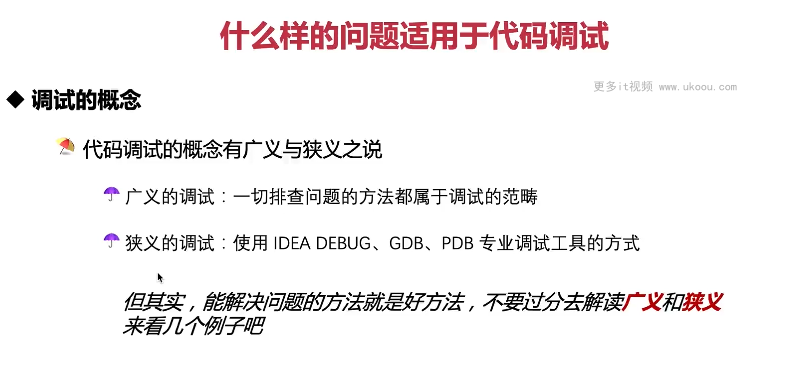

这张图片讲述了什么样的问题适用于代码调试。

1. **调试的概念**：代码调试的概念有广义与狭义之说，广义的调试指一切排障的方法，狭义的调试指使用 IDEA DEBUG、GDB、PDB 专业调试工具的方式。
2. **能解决问题的方法就是好方法**：不要过分解读广义和狭义，来看几个例子吧。

以下是一个简单的调试示例：

```java
public class MyDebugger {
    public static void main(String[] args) {
        int x = 5;
        int y = 10;
        System.out.println(x + y);
    }
}
```

在这个例子中，我们可以使用 IDEA 的 DEBUG 模式来调试这个程序，查看变量 x 和 y 的值。

总结起来，调试是解决代码问题的一个重要手段，无论是广义还是狭义的调试，只要能解决问题就是好方法。在实际应用中，可以根据需求选择合适的调试工具。


这张图片讲述了什么样的问题适用于代码调试。

1. **分清楚哪些问题适合调试**：适合调试的问题包括方法参数传递的跟踪、变量在代码逻辑中的变化过程以及不同条件下的执行轨迹和方式。
2. **不适合调试的问题**：代码执行消耗过高的 CPU（异常）和出现了大量的线程。

以下是一个简单的调试示例：

```java
public class MyDebugger {
    public static void main(String[] args) {
        int x = 5;
        int y = 10;
        System.out.println(x + y);
    }
}
```

在这个例子中，我们可以使用 IDEA 的 DEBUG 模式来调试这个程序，查看变量 x 和 y 的值。

总结起来，调试是解决代码问题的一个重要手段，但是有些问题可能不适合调试，比如代码执行消耗过高或者出现了大量的线程。在实际应用中，可以根据需求选择合适的调试工具。
