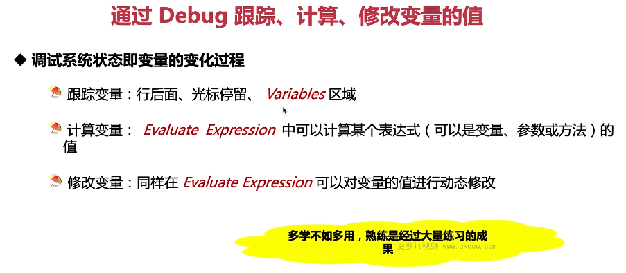

这张图片讲述了如何通过 Debug 跟踪、计算、修改变量的值。

1. **调试系统状态即变量的变化过程**：可以通过行后面、光标停留或 Variables 区域来跟踪变量。
2. **计算变量**：可以在 Evaluate Expression 中计算某个表达式的值。
3. **修改变量**：同样在 Evaluate Expression 中可以动态修改变量的值。

以下是一个简单的调试示例：

```java
public class MyDebugger {
    public static void main(String[] args) {
        int x = 5;
        int y = 10;
        System.out.println(x + y);
    }
}
```

在这个例子中，我们可以设置一个行断点在第 3 行，然后通过 IDEA 的 DEBUG 模式来观察变量 x 和 y 的值，并在 Evaluate Expression 中计算它们的和。

总结起来，Debug 是调试代码的一种重要手段，可以帮助我们理解代码的执行过程。在实际应用中，多学不如多练，熟练是经过大量练习的结果。
