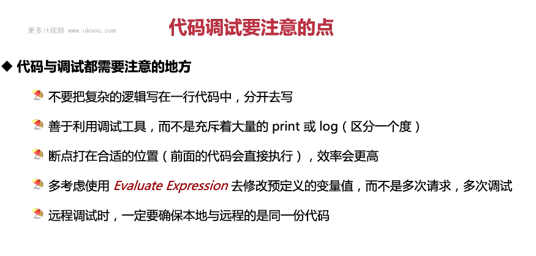

这张图片讲述了代码调试要注意的地方。

1. **代码与调试都需要注意的地方**：不要把复杂的逻辑写在一行代码中，分开来写；善于利用调试工具而不是充斥着大量的 print 或 log；断点要打在合适的位置以提高效率；多考虑使用 Evaluate Expression 去修改预定义的变量值而不是多次请求和调试。
2. **远程调试时**：一定要确保本地与远程的是同一份代码。

以下是一个简单的调试示例：

```java
public class MyDebugger {
    public static void main(String[] args) {
        int x = 5;
        int y = 10;
        System.out.println(x + y);
    }
}
```

在这个例子中，我们可以设置一个行断点在第 3 行，然后通过 IDEA 的 DEBUG 模式来观察变量 x 和 y 的值，并在 Evaluate Expression 中计算它们的和。

总结起来，调试是优化代码的重要手段，需要注意一些细节，如避免复杂逻辑、善用调试工具、正确放置断点等。在实际应用中，要根据实际情况灵活运用。
