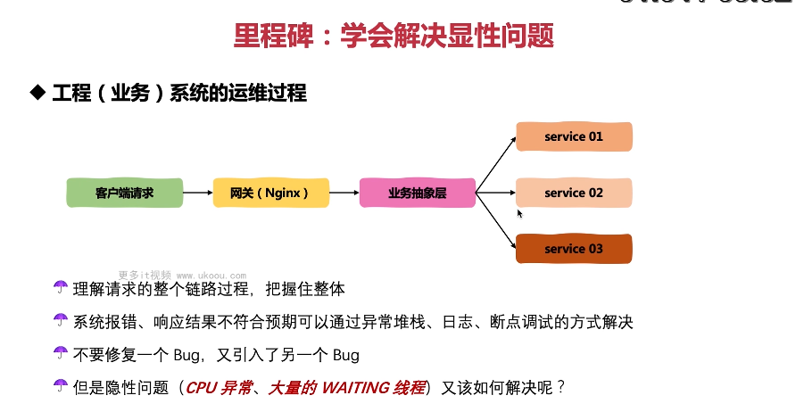

这张图片讲述了如何解决显性问题。

1. **里程碑：学会解决显性问题**：理解请求的整个链路过程，把握住整体，系统报错或响应结果不符合预期可以通过异常堆栈、日志、断点调试等方式解决。
2. **隐性问题**：如 CPU 异常、大量的 WAITING 线程等问题该如何解决？

以下是一个简单的解决显性问题的例子：

```java
public class MyExceptionResolver {
    public static void main(String[] args) throws Exception {
        try {
            int x = 5 / 0; // 引发ArithmeticException
        } catch (Exception e) {
            e.printStackTrace();
        }
    }
}
```

在这个例子中，我们可以通过捕获并打印异常堆栈来解决显性问题。

总结起来，解决显性问题是优化代码的重要手段，需要理解请求的整个链路过程，把握住整体，并注意不要引入新的 Bug。在实际应用中，要根据实际情况灵活运用。
