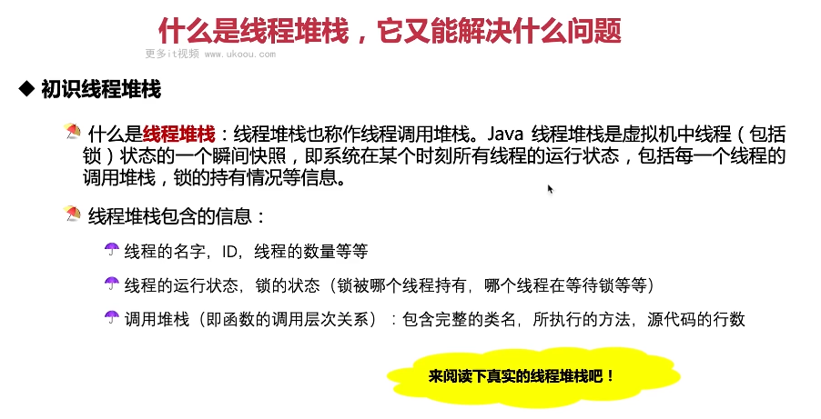
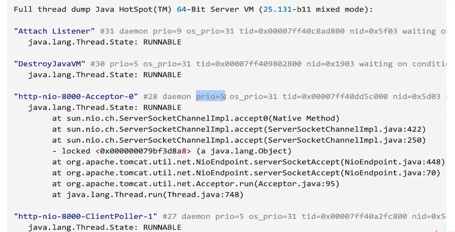

这张图片讲述了什么是线程堆栈及其能解决什么问题。

1. **初识线程堆栈**：线程堆栈也称作线程调用堆栈，是虚拟机中线程（包括锁）状态的一个瞬间快照，包含每个线程的名字、ID、运行状态、锁的状态和调用堆栈等信息。
2. **线程堆栈的信息**：包含了完整的类名、所执行的方法、源代码的行数等。

以下是一个简单的线程堆栈示例：

```java
public class ThreadStackExample {
    public static void main(String[] args) {
        new Thread(() -> {
            for (int i = 0; i < 100; i++) {
                System.out.println("Thread-1: " + i);
            }
        }).start();

        new Thread(() -> {
            for (int i = 0; i < 100; i++) {
                System.out.println("Thread-2: " + i);
            }
        }).start();
    }
}
```

在这个例子中，我们可以通过查看线程堆栈来了解每个线程的运行状态和调用层次关系。

总结起来，线程堆栈是优化代码的重要手段，可以帮助我们理解线程的状态和调用层次。在实际应用中，要根据实际情况灵活运用。



这张图片显示了一个线程堆栈的实例。

1. **线程堆栈**：展示了多个线程的状态和调用层次关系，例如"Attach Listener"、"DestroyJavaVM"、"http-nio-8000-Acceptor-0"和"http-nio-8000-ClientPoller-1"等。
2. **线程状态**：RUNNABLE 表示这些线程都在运行中。

以下是一个简单的线程堆栈示例：

```java
public class ThreadStackExample {
    public static void main(String[] args) {
        new Thread(() -> {
            for (int i = 0; i < 100; i++) {
                System.out.println("Thread-1: " + i);
            }
        }).start();

        new Thread(() -> {
            for (int i = 0; i < 100; i++) {
                System.out.println("Thread-2: " + i);
            }
        }).start();
    }
}
```

在这个例子中，我们可以通过查看线程堆栈来了解每个线程的运行状态和调用层次关系。

总结起来，线程堆栈是优化代码的重要手段，可以帮助我们理解线程的状态和调用层次。在实际应用中，要根据实际情况灵活运用。


这张图片讲述了线程堆栈信息能用来解决的问题。

1. **线程堆栈信息能解决的问题**：适合稳定性问题分析和性能问题分析，如 CPU 利用率过高、线程死锁、死循环、饥饿等。
2. **找出消耗 CPU 最高的线程**：可以通过线程堆栈找到占用 CPU 最多的线程。
3. **由于线程数量太多造成的系统失败**：例如无法创建新线程。

以下是一个简单的线程堆栈示例：

```java
public class HighCPULoader {
    public static void main(String[] args) {
        while (true) {
            System.out.println("High CPU");
        }
    }
}
```

在这个例子中，我们可以通过查看线程堆栈来找出消耗 CPU 最高的线程。

总结起来，线程堆栈是优化代码的重要手段，可以帮助我们解决稳定性问题和性能问题。在实际应用中，要根据实际情况灵活运用。
