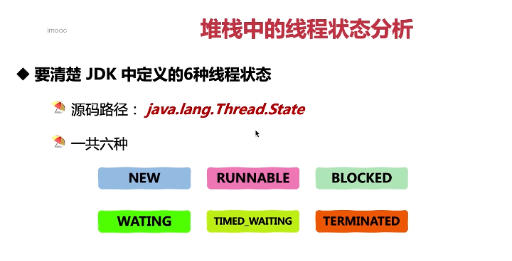

这张图片讲述了堆栈中的线程状态分析。

1. **清楚 JDK 中定义的 6 种线程状态**：源码路径为`java.lang.Thread.State`，一共有六种状态。
2. **线程状态**：NEW、RUNNABLE、BLOCKED、WATING、TIMED_WAITING 和 TERMINATED。

以下是一个简单的线程状态示例：

```java
public class ThreadStateExample {
    public static void main(String[] args) {
        Thread thread = new Thread(() -> {
            while (true) {
                System.out.println("Running...");
            }
        });
        thread.start(); // NEW

        thread.join(); // RUNNABLE

        synchronized (thread) { // BLOCKED
            try {
                thread.wait();
            } catch (InterruptedException e) {
                e.printStackTrace();
            }
        }

        try {
            thread.sleep(1000); // TIMED_WAITING
        } catch (InterruptedException e) {
            e.printStackTrace();
        }

        thread.stop(); // TERMINATED
    }
}
```

在这个例子中，我们演示了线程的不同状态。

总结起来，理解线程状态是优化代码的重要手段，可以帮助我们更好地控制线程的行为。在实际应用中，要根据实际情况灵活运用。
