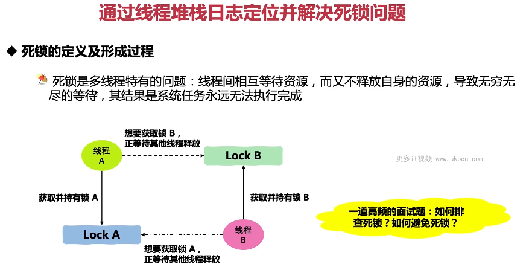
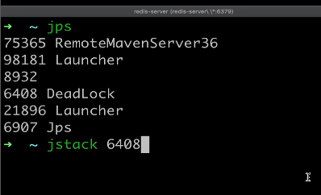
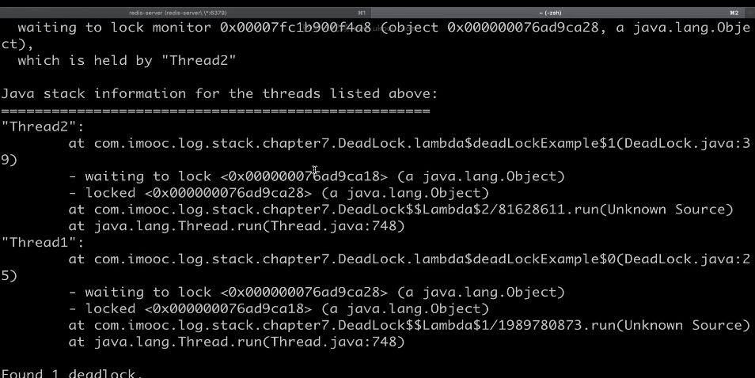
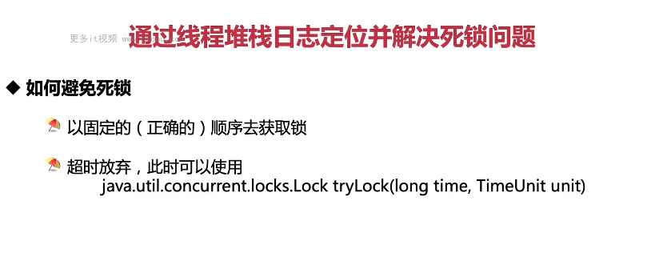

这张图片讲述了如何通过线程堆栈日志定位并解决死锁问题。

1. **死锁的定义及形成过程**：死锁是多线程特有的问题，指线程间相互等待资源而又不释放自身的资源，导致无穷无尽的等待，其结果是系统任务永远无法执行完成。
2. **死锁的检查和避免**：一道高频的面试题是如何排查死锁以及如何避免死锁。

以下是一个简单的死锁示例：

```java
public class DeadlockExample {
    private final Object lockA = new Object();
    private final Object lockB = new Object();

    public void deadlock() {
        synchronized (lockA) {
            synchronized (lockB) {
                // 死锁发生在这里，因为线程A持有lockA，而线程B持有lockB，两者互相等待对方释放
            }
        }
    }

    public void avoidDeadlock() {
        synchronized (lockA) {
            synchronized (lockB) {
                // 避免死锁的方式之一是按照一定的顺序获取锁
            }
        }
    }
}
```

在这个例子中，我们演示了死锁的发生和避免方法。

总结起来，理解死锁是优化代码的重要手段，可以帮助我们避免系统任务无法执行完成的情况。在实际应用中，要根据实际情况灵活运用。





这张图片展示了如何使用 jstack 命令查找死锁。

1. **jps 命令**：列出当前运行的 Java 进程。
2. **jstack 命令**：用于生成 Java 堆转储信息，可以用来查找死锁。
3. **死锁信息**：显示了两个线程之间的死锁情况，一个线程等待另一个线程持有的锁。

以下是一个简单的死锁示例：

```java
public class DeadLockExample {
    private final Object lockA = new Object();
    private final Object lockB = new Object();

    public void deadlock() {
        Thread thread1 = new Thread(() -> {
            synchronized (lockA) {
                synchronized (lockB) {
                    // 死锁发生在这里，因为线程A持有lockA，而线程B持有lockB，两者互相等待对方释放
                }
            }
        });

        Thread thread2 = new Thread(() -> {
            synchronized (lockB) {
                synchronized (lockA) {
                    // 死锁发生在这里，因为线程A持有lockA，而线程B持有lockB，两者互相等待对方释放
                }
            }
        });

        thread1.start();
        thread2.start();
    }

    public void avoidDeadlock() {
        Thread thread1 = new Thread(() -> {
            synchronized (lockA) {
                synchronized (lockB) {
                    // 避免死锁的方式之一是按照一定的顺序获取锁
                }
            }
        });

        Thread thread2 = new Thread(() -> {
            synchronized (lockA) {
                synchronized (lockB) {
                    // 避免死锁的方式之一是按照一定的顺序获取锁
                }
            }
        });

        thread1.start();
        thread2.start();
    }
}
```

在这个例子中，我们演示了死锁的发生和避免方法。

总结起来，理解死锁是优化代码的重要手段，可以帮助我们避免系统任务无法执行完成的情况。在实际应用中，要根据实际情况灵活运用。


这张图片讲述了如何从理论层面说死锁需要满足的四个条件。

1. **互斥条件**：一个资源每次只能被一个线程使用。
2. **请求与保持条件**：一个进程因请求资源而阻塞时，对已获得的资源保持不放。
3. **不剥夺条件**：进程已获得的资源，在未使用完之前，不能强行剥夺。
4. **循环等待条件**：若干进程之间形成一种头尾相接的循环等待资源关系。

以下是一个简单的死锁示例：

```java
public class DeadLockExample {
    private final Object lockA = new Object();
    private final Object lockB = new Object();

    public void deadlock() {
        Thread thread1 = new Thread(() -> {
            synchronized (lockA) {
                synchronized (lockB) {
                    // 死锁发生在这里，因为线程A持有lockA，而线程B持有lockB，两者互相等待对方释放
                }
            }
        });

        Thread thread2 = new Thread(() -> {
            synchronized (lockB) {
                synchronized (lockA) {
                    // 死锁发生在这里，因为线程A持有lockA，而线程B持有lockB，两者互相等待对方释放
                }
            }
        });

        thread1.start();
        thread2.start();
    }

    public void avoidDeadlock() {
        Thread thread1 = new Thread(() -> {
            synchronized (lockA) {
                synchronized (lockB) {
                    // 避免死锁的方式之一是按照一定的顺序获取锁
                }
            }
        });

        Thread thread2 = new Thread(() -> {
            synchronized (lockA) {
                synchronized (lockB) {
                    // 避免死锁的方式之一是按照一定的顺序获取锁
                }
            }
        });

        thread1.start();
        thread2.start();
    }
}
```

在这个例子中，我们演示了死锁的发生和避免方法。

总结起来，理解死锁是优化代码的重要手段，可以帮助我们避免系统任务无法执行完成的情况。在实际应用中，要根据实际情况灵活运用。



这张图片讲述了如何避免死锁。

1. **以固定的（正确的）顺序去获取锁**：这是避免死锁的一种方式。
2. **超时放弃**：当尝试获取锁超过一定时间后，可以选择放弃，此时可以使用`tryLock(long time, TimeUnit unit)`。

以下是一个简单的死锁示例：

```java
public class DeadLockExample {
    private final Object lockA = new Object();
    private final Object lockB = new Object();

    public void deadlock() {
        Thread thread1 = new Thread(() -> {
            synchronized (lockA) {
                synchronized (lockB) {
                    // 死锁发生在这里，因为线程A持有lockA，而线程B持有lockB，两者互相等待对方释放
                }
            }
        });

        Thread thread2 = new Thread(() -> {
            synchronized (lockB) {
                synchronized (lockA) {
                    // 死锁发生在这里，因为线程A持有lockA，而线程B持有lockB，两者互相等待对方释放
                }
            }
        });

        thread1.start();
        thread2.start();
    }

    public void avoidDeadlock() {
        Thread thread1 = new Thread(() -> {
            synchronized (lockA) {
                synchronized (lockB) {
                    // 避免死锁的方式之一是按照一定的顺序获取锁
                }
            }
        });

        Thread thread2 = new Thread(() -> {
            synchronized (lockA) {
                synchronized (lockB) {
                    // 避免死锁的方式之一是按照一定的顺序获取锁
                }
            }
        });

        thread1.start();
        thread2.start();
    }
}
```

在这个例子中，我们演示了死锁的发生和避免方法。

总结起来，理解死锁是优化代码的重要手段，可以帮助我们避免系统任务无法执行完成的情况。在实际应用中，要根据实际情况灵活运用。
