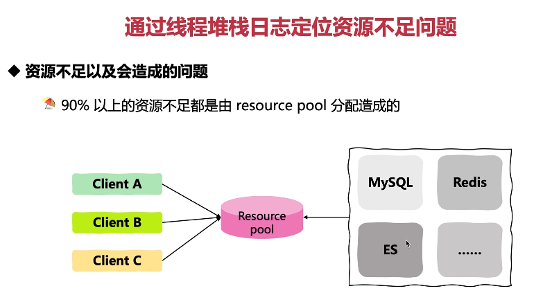
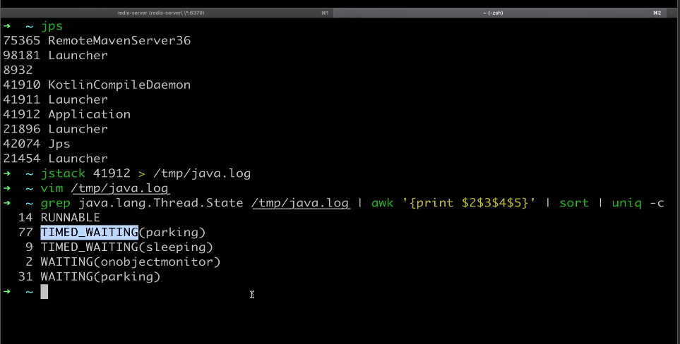
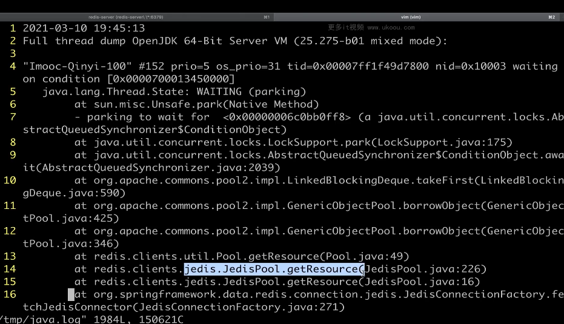

这张图片讲述了如何通过线程堆栈日志定位资源不足问题。

1. **资源不足及其造成的问题**：90%以上的资源不足都是由resource pool分配造成的。
2. **客户端与资源池的关系**：Client A、Client B和Client C都需要访问MySQL、Redis和ES等资源。

以下是一个简单的资源池示例：

```java
public class ResourcePoolExample {
    private final ResourcePool resourcePool;

    public ResourcePoolExample(ResourcePool resourcePool) {
        this.resourcePool = resourcePool;
    }

    public void useResource() {
        Resource resource = resourcePool.acquire(); // 获取资源
        try {
            // 使用资源
        } finally {
            resourcePool.release(resource); // 释放资源
        }
    }
}
```

在这个例子中，我们演示了如何使用资源池。

总结起来，理解资源池是优化代码的重要手段，可以帮助我们避免资源不足的情况。在实际应用中，要根据实际情况灵活运用。







这张图片展示了如何使用jstack命令查看线程状态。

1. **jps命令**：列出当前运行的Java进程。
2. **jstack命令**：用于生成Java堆转储信息，可以用来查看线程状态。
3. **grep和awk命令**：过滤出线程状态信息。

以下是一个简单的线程状态示例：

```java
public class ThreadStateExample {
    public static void main(String[] args) throws InterruptedException {
        Thread thread = new Thread(() -> {
            while (true) {
                System.out.println("Running...");
            }
        });
        thread.start(); // 新建状态

        thread.join(); // 运行状态

        synchronized (thread) { // 被监视器锁定状态
            try {
                thread.wait();
            } catch (InterruptedException e) {
                e.printStackTrace();
            }
        }

        Thread.sleep(1000); // 等待状态

        thread.stop(); // 终止状态
    }
}
```

在这个例子中，我们演示了线程的不同状态。

总结起来，理解线程状态是优化代码的重要手段，可以帮助我们更好地控制线程的行为。在实际应用中，要根据实际情况灵活运用。


这张图片讲述了如何解决资源不足问题。

1. **资源池设计不合理**：需要根据业务需求重新配置资源池。
2. **代码逻辑不合理**：大量的瞬时短暂连接需要避免。
3. **考虑硬件承压能力**：同样要考虑资源本身的承压能力，特别是硬件本身。

以下是一个简单的资源池示例：

```java
public class ResourcePoolExample {
    private final ResourcePool resourcePool;

    public ResourcePoolExample(ResourcePool resourcePool) {
        this.resourcePool = resourcePool;
    }

    public void useResource() {
        Resource resource = resourcePool.acquire(); // 获取资源
        try {
            // 使用资源
        } finally {
            resourcePool.release(resource); // 释放资源
        }
    }
}
```

在这个例子中，我们演示了如何使用资源池。

总结起来，理解资源池是优化代码的重要手段，可以帮助我们避免资源不足的情况。在实际应用中，要根据实际情况灵活运用。