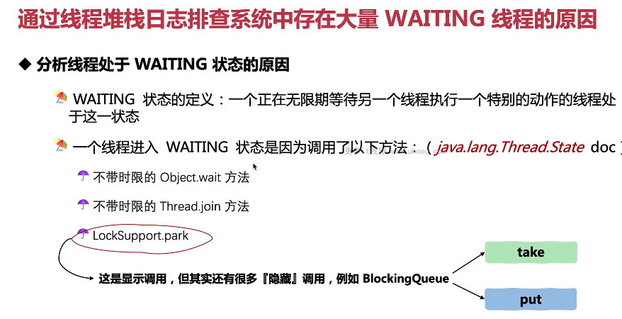

这张图片讲述了如何分析线程处于WAITING状态的原因。

1. **WAITING状态定义**：一个正在无限期等待另一个线程执行一个特别的动作的线程处于此状态。
2. **进入WAITING状态的方法**：不带时限的Object.wait方法、不带时限的Thread.join方法以及LockSupport.park。
3. **隐藏调用**：显示调用之外还有很多“隐藏”调用，例如BlockingQueue。

以下是一个简单的WAITING状态示例：

```java
public class WaitingStateExample {
    public static void main(String[] args) throws InterruptedException {
        final Object lock = new Object();

        Thread waitingThread = new Thread(() -> {
            synchronized (lock) {
                try {
                    lock.wait(); // 不带时限的wait方法
                } catch (InterruptedException e) {
                    e.printStackTrace();
                }
            }
        });

        waitingThread.start();
        waitingThread.join(); // 不带时限的join方法

        LockSupport.park(); // park方法

        BlockingQueue queue = new ArrayBlockingQueue<>(1);
        queue.take(); // take操作
        queue.put(new Object()); // put操作
    }
}
```

在这个例子中，我们演示了各种导致线程进入WAITING状态的方法。

总结起来，理解线程状态是优化代码的重要手段，可以帮助我们更好地控制线程的行为。在实际应用中，要根据实际情况灵活运用。


这张图片讲述了如何避免大量线程处于WAITING状态。

1. **任意创建线程池**：大量的线程获取不到task，导致WAITING线程很多。
2. **未及时关闭线程**：线程提交任务完成后没有及时关闭，导致WAITING线程多。
3. **线程池配置不当**：由于需要处理的任务较多，线程池中的线程数配置过大，但任务并不集中，导致频繁上下文切换，浪费虚拟内存。

以下是一个简单的线程池示例：

```java
public class ThreadPoolExample {
    public static void main(String[] args) {
        int corePoolSize = 1; // 核心线程数
        int maximumPoolSize = 10; // 最大线程数
        long keepAliveTime = 1000L; // 空闲线程存活时间
        TimeUnit unit = TimeUnit.MILLISECONDS; // 时间单位
        BlockingQueue<Runnable> workQueue = new LinkedBlockingQueue<>(100); // 工作队列
        ThreadPoolExecutor executor = new ThreadPoolExecutor(corePoolSize, maximumPoolSize, keepAliveTime, unit, workQueue);

        for (int i = 0; i < 1000; i++) {
            executor.execute(() -> {
                // 提交任务
            });
        }

        // 关闭线程池
        executor.shutdown();
    }
}
```

在这个例子中，我们演示了如何合理设置线程池参数来避免WAITING线程过多。

总结起来，理解线程状态是优化代码的重要手段，可以帮助我们更好地控制线程的行为。在实际应用中，要根据实际情况灵活运用。


