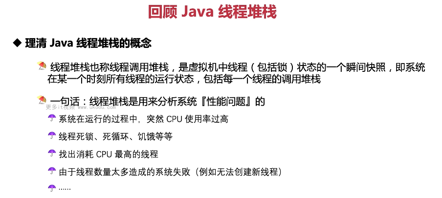
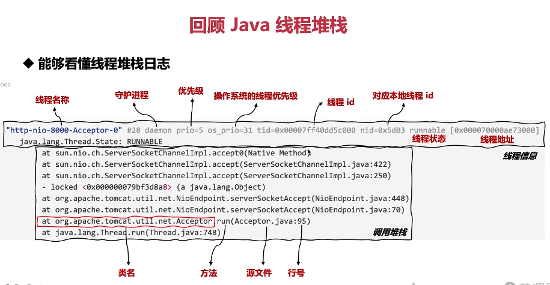
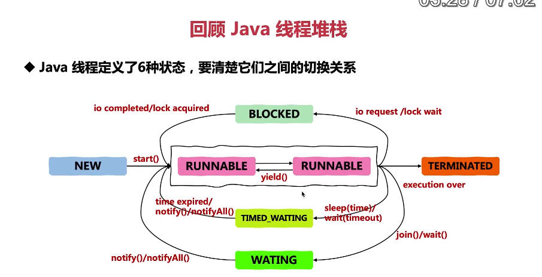

这张图片回顾了 Java 线程堆栈的概念。

1. **线程堆栈定义**：线程堆栈也称线程调用堆栈，是虚拟机中线程（包括锁）状态的一个瞬间快照，即系统在某一时刻所有线程的运行状态，包括每个线程的调用堆栈。
2. **用途**：一句话概括就是用来分析系统性能问题，如 CPU 使用率过高、死锁、死循环、饥饿等问题。
3. **找出高消耗线程**：找出消耗 CPU 最高的线程。
4. **线程数量过多**：由于线程数量太多造成的系统失败（例如无法创建新线程）。

以下是一个简单的线程堆栈示例：

```java
public class StackTraceExample {
    public static void main(String[] args) {
        Thread.currentThread().dumpStack(); // 打印当前线程的堆栈
    }
}
```

在这个例子中，我们演示了如何打印当前线程的堆栈。

总结起来，理解线程堆栈是优化代码的重要手段，可以帮助我们更好地分析系统性能问题。在实际应用中，要根据实际情况灵活运用。



这张图片讲述了如何看懂线程堆栈日志。

1. **线程名称**：线程的名字。
2. **守护进程**：是否为守护线程。
3. **优先级**：线程的优先级。
4. **操作系统线程优先级**：对应操作系统的线程优先级。
5. **线程 ID**：线程的唯一标识符。
6. **线程状态**：线程的状态，如 RUNNABLE、BLOCKED 等。
7. **线程地址**：线程的内存地址。
8. **线程信息**：线程的相关信息。
9. **调用堆栈**：线程调用的具体方法及其源文件和行号。

以下是一个简单的线程堆栈日志示例：

```java
public class StackTraceExample {
    public static void main(String[] args) {
        new Thread(() -> {
            while (true) {
                System.out.println("Running...");
            }
        }).start();
    }
}
```

在这个例子中，我们演示了一个简单的线程堆栈日志。

总结起来，理解线程堆栈是优化代码的重要手段，可以帮助我们更好地分析系统性能问题。在实际应用中，要根据实际情况灵活运用。



这张图片回顾了 Java 线程堆栈并解释了线程之间的切换关系。

1. **线程状态**：Java 定义了六种线程状态，包括 NEW、RUNNABLE、BLOCKED、WATING、TIMED_WAITING 和 TERMINATED。
2. **状态转换**：通过 start()方法从 NEW 到 RUNNABLE；通过 yield()、sleep(time)/wait(timeout)或 notify()/notifyAll()从 RUNNABLE 到 TIMED_WAITING；通过 join()或 wait()从 RUNNABLE 到 WATING；通过 io completed/lock acquired 从 BLOCKED 回到 RUNNABLE；通过 execution over 从 RUNNABLE 到 TERMINATED。

以下是一个简单的线程状态转换示例：

```java
public class StateTransitionExample {
    public static void main(String[] args) {
        Thread thread = new Thread(() -> {
            while (true) {
                System.out.println("Running...");
            }
        });

        thread.start(); // NEW -> RUNNABLE
        thread.yield(); // RUNNABLE -> RUNNABLE
        thread.sleep(1000); // RUNNABLE -> TIMED_WAITING
        thread.notify(); // WATING -> RUNNABLE
        thread.join(); // RUNNABLE -> WATING
        thread.block(); // RUNNABLE -> BLOCKED
    }
}
```

在这个例子中，我们演示了线程状态的转换。

总结起来，理解线程状态转换是优化代码的重要手段，可以帮助我们更好地控制线程的行为。在实际应用中，要根据实际情况灵活运用。


这张图片回顾了 Java 线程堆栈并展示了线程堆栈日志解决问题实战。

1. **死锁问题**：互相等待造成的死锁问题。
2. **CPU 使用异常**：CPU 使用异常问题。
3. **消耗最多 CPU 的线程**：找到消耗 CPU 最多的线程。
4. **大量 WAITING 线程**：系统中存在的大量 WAITING 线程。

以下是一个简单的线程堆栈日志示例：

```java
public class StackTraceExample {
    public static void main(String[] args) {
        new Thread(() -> {
            synchronized ("lockA") {
                System.out.println("Thread A is holding lockA");
                synchronized ("lockB") {
                    System.out.println("Thread A is holding both locks");
                }
            }
        }).start();

        new Thread(() -> {
            synchronized ("lockB") {
                System.out.println("Thread B is holding lockB");
                synchronized ("lockA") {
                    System.out.println("Thread B is holding both locks");
                }
            }
        }).start();
    }
}
```

在这个例子中，我们演示了死锁的问题。

总结起来，理解线程堆栈是优化代码的重要手段，可以帮助我们更好地分析系统性能问题。在实际应用中，要根据实际情况灵活运用。
