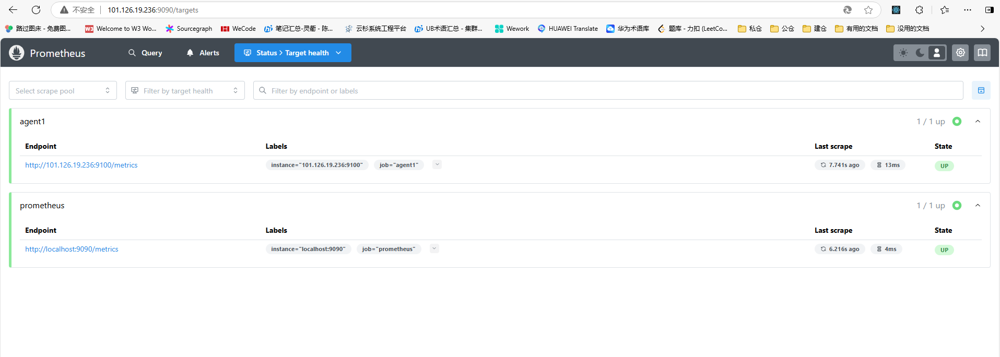

1、https://prometheus.io/download/ 下载node_exporter
对应的cpu架构可使用uname -m 查询。

2、
执行
tar xf node_exporter-1.8.2.linux-amd64.tar.gz -C /usr/local
mv /usr/local/node_exporter-1.8.2.linux-amd64/ /usr/local/node_exporter
cd /usr/local/node_exporter/
nohup ./node_exporter &

启动node_exporter

3、
docker cp prometheus:/etc/prometheus/prometheus.yml $PWD
编辑prometheus.yml 
一个样例文件：
``` yml
# my global config
global:
  scrape_interval: 15s # Set the scrape interval to every 15 seconds. Default is every 1 minute.
  evaluation_interval: 15s # Evaluate rules every 15 seconds. The default is every 1 minute.
  # scrape_timeout is set to the global default (10s).

# Alertmanager configuration
alerting:
  alertmanagers:
    - static_configs:
        - targets:
          # - alertmanager:9093

# Load rules once and periodically evaluate them according to the global 'evaluation_interval'.
rule_files:
  # - "first_rules.yml"
  # - "second_rules.yml"

# A scrape configuration containing exactly one endpoint to scrape:
# Here it's Prometheus itself.
scrape_configs:
  # The job name is added as a label `job=<job_name>` to any timeseries scraped from this config.
  - job_name: "prometheus"

    # metrics_path defaults to '/metrics'
    # scheme defaults to 'http'.

    static_configs:
      - targets: ["localhost:9090"]
  - job_name: "agent1"

    static_configs:
      - targets: ["101.126.19.236:9100"]
```


docker cp $PWD/prometheus.yml prometheus:/etc/prometheus/prometheus.yml

docker restart prometheus

登录Prometheus 管理平台查看服务状态。
